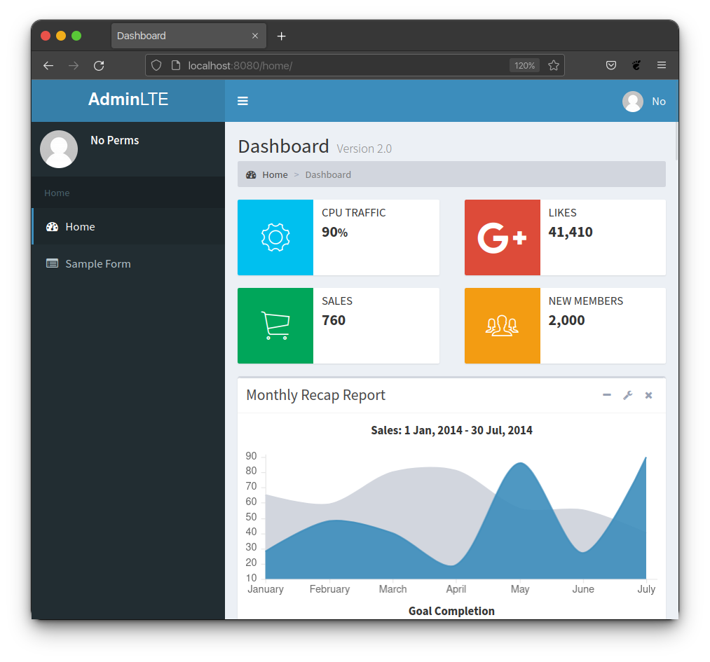
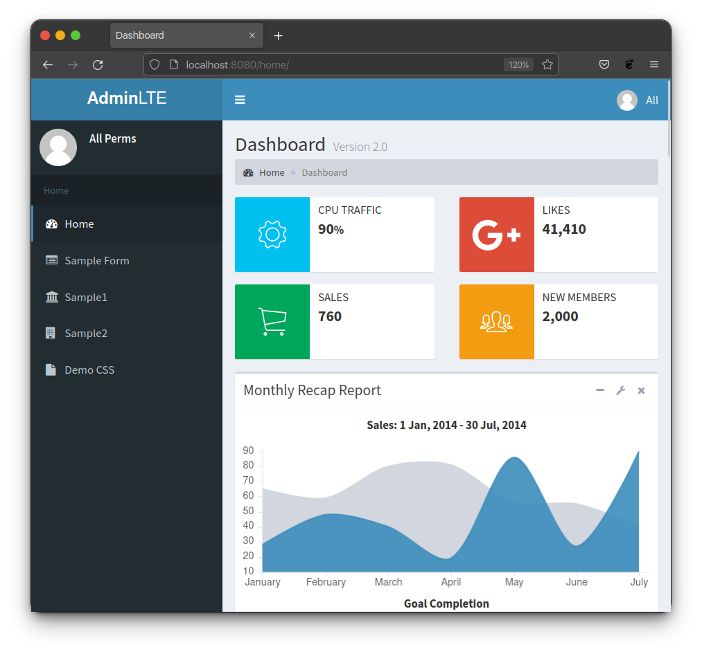

Authorization
*************

Setting up authorization for the sidebar menu and its associated links requires
choosing a Policy_ and then properly using some Decorators_ or Mixins_ provided
by this package to set permissions on various views. Setting the permissions on
the view has the added benefit of not only preventing users from accessing a
view, but also automatically hiding links on the sidebar menu from the users
that do not have access.

Policy
======

The first step in using and configuring authorization for views and sidebar
menu links is to determine what general policy you want to adhere to.
Your choices are:

1. `Loose Policy`_ - By default all sidebar links are visible and accessible to
   the user.

   * Majority of sidebar links are visible to all users.
   * Link will still be visible if you set a permission on that route's view
     and that user has the correct permission.
   * Link will be hidden if you set a permission on that route's view and the
     user does not have the correct permission.

2. `Strict Policy`_ - By default all sidebar links are hidden from the user.

   * Majority of sidebar links are hidden to all users.
   * Link will become visible if you set a permission on that route's view
     and that user has the correct permission.
   * Link will become visible if you put the route in an explicit whitelist
     defined in the settings.

   .. important::

       The strictness in this policy is related to the visibility of sidebar
       menu links only. If no permissions are set on a corresponding view,
       the sidebar menu link is not visible, but the user can still technically
       gain access to the page assuming that they know the url and directly
       go to it. To completely block users from a route, you **Must** define
       a permission on the view or handle it with some other form of permission
       checking provided by Django.

Once you have determined what general policy you want to follow, use
the corresponding section to properly set up and configure authorization.

Loose Policy
------------

Use the following steps to finish out your policy.
Refer to the :doc:`configuration/authorization` section for information about
the specific settings in settings.py mentioned below.

1. Ensure that the ``ADMINLTE2_USE_STRICT_POLICY``
   is either not defined in ``settings.py``, or is set to ``False`` if it is
   defined.

2. If you are using function based views, read the `Function Based Views`_
   section and follow the steps in the `Loose Decorator Example`_ section to
   add permissions to views that require permission to access.

4. If you are using class based views, read the `Class Based Views`_ section
   and follow the steps in the `Loose Mixin Example`_ section to add
   permissions to views that require permission to access.

Strict Policy
-------------

Use the following steps to finish out your policy.
Refer to the :doc:`configuration/authorization` section for information about
the specific settings in settings.py mentioned below.

1. Ensure that the ``ADMINLTE2_USE_STRICT_POLICY``
   is defined in ``settings.py`` and is set to ``True``.

2. If you are using function based views, read the `Function Based Views`_
   section and follow the steps in the `Strict Decorator Example`_ section
   to add permissions to views that require permission to access.

3. If you are using class based views, read the `Class Based Views`_ section
   and follow the steps in the `Strict Mixin Example`_ section to add
   permissions to views that require permission to access.

4. Add any routes that do not require a specific permission and should
   be available to everyone to the ``ADMINLTE2_STRICT_POLICY_WHITELIST``
   in ``settings.py``

Function Based Views
====================

Decorators
----------

There are three decorators provided by Django-AdminLTE-2 that can be used on a
view to control whether a user has access to both the view, and the visibility
of any links in the sidebar that link to that view.
Those decorators are:

* :ref:`authorization:login required decorator` imported with

  .. code:: python

      from django_adminlte_2.decorators import login_required

* :ref:`authorization:permission required decorator` imported with

  .. code:: python

      from django_adminlte_2.decorators import permission_required

* :ref:`authorization:permission required one decorator` imported with

  .. code:: python

      from django_adminlte_2.decorators import permission_required_one

Login Required Decorator
^^^^^^^^^^^^^^^^^^^^^^^^

``@login_required``

This decorator will enforce that a user is logged into the system before they
can access the view. Django's default
`login_required <https://docs.djangoproject.com/en/dev/topics/auth/default/#the-login-required-decorator>`_
decorator is used behind the scenes and is only recreated in this package in
order to add the magic of automatic sidebar link rendering.

When using this decorator on a function view, if the user is not logged in,
the user will not be able to access this view nor will they see a sidebar menu
entry that maps to this view. However, if the user is logged in,
they will see the sidebar link and have access.

.. code:: python

    from django_adminlte_2.decorators import login_required

    @login_required
    def demo_css(request):
        """Show examples of extra-features.css"""
        return render(request, 'adminlte2/demo_css.html', {
            'bootstrap_types': ['primary'],
        })

Permission Required Decorator
^^^^^^^^^^^^^^^^^^^^^^^^^^^^^

``@permission_required``

This decorator will list all required permissions for the view. Django's default
`permission_required <https://docs.djangoproject.com/en/dev/topics/auth/default/#the-permission-required-decorator>`_
decorator is used behind the scenes and is only recreated in this package in
order to add the magic of automatic sidebar link rendering.

When using this decorator on a function view, if the user does not have all of
the permissions that we define in this decorator, the user will not be able to
access this view nor will they see a sidebar menu entry that maps to this view.
However, if the user does have all of these permissions, they will see the
sidebar link and have access.

.. code:: python

    from django_adminlte_2.decorators import permission_required

    @permission_required([
        'auth.add_group',
        'auth.change_group',
        'auth.delete_group'
    ])
    def sample1(request):
        """Show default sample1 page"""
        return render(request, 'adminlte2/sample1.html', {})

Permission Required One Decorator
^^^^^^^^^^^^^^^^^^^^^^^^^^^^^^^^^

``@permission_required_one``

This decorator will list the permissions that a user must have at least one
of in order to access the view and see the associated sidebar Link.

.. note::

    Django does not provide a similar decorator by default. This decorator is
    exclusive to this package.

When using this decorator on a function view, if the user does not have at
least one of the permissions that we define on this decorator, the user will
not be able to access this view nor will they see a sidebar menu entry that
maps to this view. However, if the user has at least one of any of these
permissions, they will see the sidebar link and have access.

.. tip::

    This decorator is good when you have a landing page for a section of your
    site and don't care whether the user can only read or has full edit
    permissions. Either one should allow the user to see the sidebar link and
    gain access to the landing page where further restrictions can be used
    as needed.

.. code:: python

    from django_adminlte_2.decorators import permission_required_one

    @permission_required_one([
        'auth.add_permission',
        'auth.change_permission',
        'auth.delete_permission'
    ])
    def sample2(request):
        """Show default sample2 page"""
        return render(request, 'adminlte2/sample2.html', {})

Decorator Examples
------------------

Loose Decorator Example
^^^^^^^^^^^^^^^^^^^^^^^

In this example there are four routes, views, and sidebar entries.

* **Home** - should be shown to all users regardless of being logged in or
  having permission.
* **Sample 1** - requires two permissions (and thus being logged in) to see and
  access.
* **Sample 2** - should require at least one of the listed permissions
  (and being logged in) to see and access. But, we intentionally
  forgot to add that permission to demonstrate what will happen.
* **Demo CSS** - requires simply being logged in to see and access.

.. note::

    In the below files, we have purposely made a mistake in regards to the
    **Sample2** view in order to no only demonstrate how the various files and
    contents work, but also to show what sort of side effects to expect when
    using the **Loose Policy**. Below this initial attempt we correct our
    initial mistake and show the proper configuration as well as what users
    will see.

.. _loose_decorator_settings.py:

settings.py
"""""""""""

.. code:: python

    # Sidebar menu definition.
    ADMINLTE2_MENU = [
        {
            'text': 'Home',
            'links': [
                {
                    'route': 'home',
                    'text': 'Home',
                    'icon': 'fa fa-dashboard',
                },
                {
                    'route': 'sample1',
                    'text': 'Sample1',
                    'icon': 'fa fa-bank'
                },
                {
                    'route': 'sample2',
                    'text': 'Sample2',
                    'icon': 'fa fa-building'
                },
                {
                    'route': 'demo-css',
                    'text': 'Demo CSS',
                    'icon': 'fa fa-file'
                },
            ]
        },
    ]
    # Ensures that we are using the Loose Policy.
    ADMINLTE2_USE_STRICT_POLICY = False

.. _loose_decorator_urls.py:

urls.py
"""""""

.. code:: python

    urlpatterns = [
        path('home/', views.home, name="home"),
        path('sample1/', views.sample1, name="sample1"),
        path('sample2/', views.sample2, name="sample2"),
        path('demo-css/', views.demo_css, name="demo-css"),
    ]

.. _loose_decorator_views.py:

views.py
""""""""

.. code:: python

    from django.shortcuts import render
    from django_adminlte_2.decorators import (
        login_required,
        permission_required,
        permission_required_one,
    )

    def home(request):
        """Show home page"""
        return render(request, 'adminlte2/home.html', {})

    @permission_required(['auth.add_permission', 'auth.view_permission',])
    def sample1(request):
        """Show sample1 page"""
        return render(request, 'adminlte2/sample1.html', {})

    def sample2(request):
        """Show sample2 page"""
        return render(request, 'adminlte2/sample2.html', {})

    @login_required()
    def demo_css(request):
    """Show examples of extra-features.css"""
    return render(request, 'adminlte2/demo_css.html', {
        'bootstrap_types': ['primary'],
    })

What logged out anonymous users can see and access.
"""""""""""""""""""""""""""""""""""""""""""""""""""

.. image:: ../img/authorization/loose_policy_anonymous_wrong.png
    :alt: Loose Policy with anonymous user and missed decorator.

What logged in users without correct permissions can see and access.
""""""""""""""""""""""""""""""""""""""""""""""""""""""""""""""""""""

.. image:: ../img/authorization/loose_policy_no_perms_wrong.png
    :alt: Loose Policy with no permission user and missed decorator.

What logged in users with correct permissions can see and access.
"""""""""""""""""""""""""""""""""""""""""""""""""""""""""""""""""

.. image:: ../img/authorization/loose_policy_with_perms_wrong.png
    :alt: Loose Policy with full permission user and missed decorator.

What logged in superusers can see and access.
"""""""""""""""""""""""""""""""""""""""""""""

.. image:: ../img/authorization/loose_policy_superuser_wrong.png
    :alt: Loose Policy with superuser and missed decorator.

.. warning::

    We wanted to prevent the **Sample2** view from being accessed by people that
    do not have at least one permission, but forgot to add that to our view.
    Because we are using a Loose policy, everyone can see and have access this
    view. This is the **"Loose"** part of the loose policy as it defaults to
    everyone being able to see every view unless a permission is explicitly
    set on that view to add security.

    Let's fix our mistake so that **Sample2** is protected and see the
    difference.

.. _loose_decorator_fixed_views.py:

views.py
""""""""

Add the missing ``permission_required_one`` decorator to the Sample2 view.

.. code:: python

    @permission_required_one(['auth.add_permission', 'auth.view_permission',])
    def sample2(request):
        """Show sample2 page"""
        return render(request, 'adminlte2/sample2.html', {})

What logged out users can see and access now.
"""""""""""""""""""""""""""""""""""""""""""""

.. image:: ../img/authorization/loose_policy_anonymous_correct.png
    :alt: Loose Policy with anonymous user and correct decorator.

What logged in users without correct permissions can see and access now.
""""""""""""""""""""""""""""""""""""""""""""""""""""""""""""""""""""""""

.. image:: ../img/authorization/loose_policy_no_perms_correct.png
    :alt: Loose Policy with no permission user and correct decorator.

What logged in users with correct permissions can see and access now.
"""""""""""""""""""""""""""""""""""""""""""""""""""""""""""""""""""""

.. image:: ../img/authorization/loose_policy_with_perms_correct.png
    :alt: Loose Policy with full permission user and correct decorator.

What logged in superusers can see and access now.
"""""""""""""""""""""""""""""""""""""""""""""""""

.. image:: ../img/authorization/loose_policy_superuser_correct.png
    :alt: Loose Policy with superuser and correct decorator.

Strict Decorator Example
^^^^^^^^^^^^^^^^^^^^^^^^

In this example there are four routes, views, and sidebar entries.

* **Home** - should be shown to all users regardless of being logged in or
  having permission. But, we intentionally forgot to add that view's route to
  the ``ADMINLTE2_STRICT_POLICY_WHITELIST`` in order to demonstrate what will
  happen.
* **Sample 1** - requires two permissions (and thus being logged in) to see and
  access.
* **Sample 2** - should require at least one of the listed permissions
  (and being logged in) to see and access. But, we intentionally
  forgot to add that permission to demonstrate what will happen.
* **Demo CSS** - requires simply being logged in to see and access.

.. note::

    In the below files, we have purposely made a mistake in regards to the
    **Home** and **Sample2** views in order to no only demonstrate how the
    various files and contents work, but also to show what sort of side effects
    to expect when using the **Strict Policy**. Below this initial attempt we
    correct our mistake and show the proper configuration as well as what users
    will see.

.. _strict_decorator_settings.py:

settings.py
"""""""""""

.. code:: python

    # Sidebar menu definition.
    ADMINLTE2_MENU = [
        {
            'text': 'Home',
            'links': [
                {
                    'route': 'home',
                    'text': 'Home',
                    'icon': 'fa fa-dashboard',
                },
                {
                    'route': 'sample1',
                    'text': 'Sample1',
                    'icon': 'fa fa-bank'
                },
                {
                    'route': 'sample2',
                    'text': 'Sample2',
                    'icon': 'fa fa-building'
                },
                {
                    'route': 'demo-css',
                    'text': 'Demo CSS',
                    'icon': 'fa fa-file'
                },
            ]
        },
    ]
    # Ensures that we are using the Strict Policy.
    ADMINLTE2_USE_STRICT_POLICY = True

.. _strict_decorator_urls.py:

urls.py
"""""""

.. code:: python

    urlpatterns = [
        path('home/', views.home, name="home"),
        path('sample1/', views.sample1, name="sample1"),
        path('sample2/', views.sample2, name="sample2"),
        path('demo-css/', views.demo_css, name="demo-css"),
    ]

.. _strict_decorator_views.py:

views.py
""""""""

.. code:: python

    from django.shortcuts import render
    from django_adminlte_2.decorators import (
        login_required,
        permission_required,
        permission_required_one,
    )

    def home(request):
        """Show home page"""
        return render(request, 'adminlte2/home.html', {})

    @permission_required(['auth.add_permission', 'auth.view_permission',])
    def sample1(request):
        """Show sample1 page"""
        return render(request, 'adminlte2/sample1.html', {})

    def sample2(request):
        """Show sample2 page"""
        return render(request, 'adminlte2/sample2.html', {})

    @login_required()
    def demo_css(request):
    """Show examples of extra-features.css"""
    return render(request, 'adminlte2/demo_css.html', {
        'bootstrap_types': ['primary'],
    })

What logged out users can see and access.
"""""""""""""""""""""""""""""""""""""""""

.. note::

    As seen in the following screenshots, the route still works and the user
    can still directly visit and see the **Home** page despite there not being
    a sidebar link for it.
    This is because the **Strict policy** is only strict at preventing the
    sidebar menu from rendering links. In order to fully prevent a user from
    both seeing and directly accessing a view, you must use a decorator on that
    view.

.. image:: ../img/authorization/strict_policy_anonymous_wrong.png
    :alt: Strict Policy with anonymous user and missed decorator and setting.

What logged in users without correct permissions can see and access.
""""""""""""""""""""""""""""""""""""""""""""""""""""""""""""""""""""

What logged in users with correct perm can see and access.
""""""""""""""""""""""""""""""""""""""""""""""""""""""""""

.. image:: ../img/authorization/strict_policy_with_perms_wrong.png
    :alt: Strict Policy with full permission user and missed decorator/setting.

What logged in superusers can see and access.
"""""""""""""""""""""""""""""""""""""""""""""

.. note::
    Even though we forgot to add the **Home** route to the whitelist and add
    permissions to the **Sample2** view, the superuser can still see those
    sidebar entries and has access to those pages as superusers can always see
    everything.

.. image:: ../img/authorization/strict_policy_superuser_wrong.png
    :alt: Strict Policy with superuser and missed decorator/setting.

.. warning::

    We wanted the **Home** view to be visible and accessible to all people but
    as configured, it is not visible to anyone. In addition, the **Sample2**
    page is also not visible to anyone. Because we are using the Strict Policy,
    all sidebar menu links are hidden by default. This is the **"Strict"** part
    of the Strict Policy as it defaults to everyone not being able to see every
    sidebar menu link unless a permission is explicitly set on that view or the
    route for that view is added to the ``ADMINLTE2_STRICT_POLICY_WHITELIST``.

    In the case of the **Home** view, we are going to add the route to the
    ``ADMINLTE2_STRICT_POLICY_WHITELIST`` so that everyone will be able to see
    the **Home** link regardless of their permissions. In the case of
    **Sample2**, we are going to add the missing permissions that we
    accidentally omitted.

    Let's fix our mistake so that **Home** and **Sample2** are visible to who
    they are supposed to be.

.. _strict_decorator_fixed_settings.py:

settings.py
"""""""""""

Add the missing whitelist to the settings file and ensure it includes the home
route.

.. code:: python

    # Lists the routes that do not need permissions to be seen by all users.
    ADMINLTE2_STRICT_POLICY_WHITELIST = ['home']

.. _strict_decorator_fixed_views.py:

views.py
""""""""

Add the missing ``permission_required_one`` decorator to the Sample2 view.

.. code:: python

    @permission_required_one(['auth.add_permission', 'auth.view_permission',])
    def sample2(request):
        """Show sample2 page"""
        return render(request, 'adminlte2/sample2.html', {})

What logged out users can see and access now.
"""""""""""""""""""""""""""""""""""""""""""""

.. image:: ../img/authorization/strict_policy_anonymous_correct.png
    :alt: Strict Policy with anonymous user and correct decorator/setting.

What logged in users without correct permissions can see and access now.
""""""""""""""""""""""""""""""""""""""""""""""""""""""""""""""""""""""""

.. image:: ../img/authorization/strict_policy_no_perms_correct.png
    :alt: Strict Policy with no permission user and correct decorator/setting.

What logged in users with correct permissions can see and access now.
"""""""""""""""""""""""""""""""""""""""""""""""""""""""""""""""""""""

What logged in superusers can see and access now.
"""""""""""""""""""""""""""""""""""""""""""""""""

.. image:: ../img/authorization/strict_policy_superuser_correct.png
    :alt: Strict Policy with superuser and correct decorator/setting.

Class Based Views
=================

Mixins
------

There are two mixins provided by Django-AdminLTE-2 that can be used on a class
based view to control whether a user has access to both the view, and the
visibility of any links in the sidebar that link to that view.
Those decorators are:

* :ref:`authorization:login required mixin` imported with

  .. code:: python

      from django_adminlte_2.mixins import LoginRequiredMixin

* :ref:`authorization:permission required mixin` imported with

  .. code:: python

      from django_adminlte_2.mixing import PermissionRequiredMixin

Login Required Mixin
^^^^^^^^^^^^^^^^^^^^

``LoginRequiredMixin``

This mixin will enforce that a user is logged into the system before they
can access the view. Django's default
`LoginRequiredMixin <https://docs.djangoproject.com/en/dev/topics/auth/default/#the-loginrequired-mixin>`_
is used behind the scenes and is only recreated in this package in order to add
the magic of automatic sidebar Link rendering.

When using this mixin on a class based view, if the user in not logged in,
the user will not be able to access this view nor will they see a sidebar menu
entry that maps to this view. However, if the user is logged in,
they will see the sidebar link and have access to the view.

.. code:: python

    from django_adminlte_2.mixins import LoginRequiredMixin

    class DemoCss(LoginRequiredMixin, View):
        """Show examples of extra-features.css"""
        def get(request):
            return render(request, 'adminlte2/demo_css.html', {
                'bootstrap_types': ['primary'],
            })

Permission Required Mixin
^^^^^^^^^^^^^^^^^^^^^^^^^

``PermissionRequiredMixin``

This mixin will enforce that a user has either all or one of a list of
permissions before they can access the view. Django's default
`PermissionRequired <https://docs.djangoproject.com/en/dev/topics/auth/default/#the-permissionrequiredmixin-mixin>`_
is used behind the scenes and is only recreated in this package in order to add
the magic of automatic sidebar link rendering.

There are two class level attributes used in conjunction with this mixin.
``permission_required`` or ``permission_required_one``.
Which one you use is dependent on whether you want to require all permissions
or only one of many permissions for the user to see the sidebar menu link and
have access to the view.

Permission Required Attribute
"""""""""""""""""""""""""""""

.. code:: python

    from django_adminlte_2.mixins import PermissionRequiredMixin

    class Sample1(PermissionRequiredMixin, View):
    """Show sample1 page"""

        permission_required = [
            'auth.add_permission',
            'auth.change_permission',
            'auth.delete_permission'
        ]

        def get(self, request, *args, **kwargs):
            return render(request, 'adminlte2/sample1.html', {})

Permission Required One Attribute
"""""""""""""""""""""""""""""""""

.. note::

    Django does not provide a similar class level attribute by default.
    This attribute and it's functionality is exclusive to this package.

.. tip::

    This class level attribute is good when you have a landing page for a
    section of your site and don't care whether the user can only read or has
    full edit permissions. Either one should allow the user to see the sidebar
    link and gain access to the landing page where further restrictions can be
    used as needed.

.. code:: python

    from django_adminlte_2.mixins import PermissionRequiredMixin

    class Sample2(PermissionRequiredMixin, View):
        """Show sample2 page"""

        permission_required_one = [
            'auth.add_permission',
            'auth.change_permission',
            'auth.delete_permission'
        ]

        def get(self, request, *args, **kwargs):
            return render(request, 'adminlte2/sample2.html', {})

Mixin Examples
--------------

Loose Mixin Example
^^^^^^^^^^^^^^^^^^^

In this example there are four routes, views, and sidebar entries.

* **Home** - should be shown to all users regardless of being logged in or
  having permission.
* **Sample 1** - requires two permissions (and thus being logged in) to see and
  access.
* **Sample 2** - should require at least one of the listed permissions
  (and being logged in) to see and access. But, we intentionally
  forgot to add that permission to demonstrate what will happen.
* **Demo CSS** - requires simply being logged in to see and access.

.. note::

    In the below files, we have purposely made a mistake in regards to the
    **Sample2** view in order to no only demonstrate how the various files and
    contents work, but also to show what sort of side effects to expect when
    using the **Loose Policy**. Below this initial attempt we correct our
    initial mistake and show the proper configuration as well as what users
    will see.

.. _loose_mixin_settings.py:

settings.py
"""""""""""

.. code:: python

    # Sidebar menu definition.
    ADMINLTE2_MENU = [
        {
            'text': 'Home',
            'links': [
                {
                    'route': 'home',
                    'text': 'Home',
                    'icon': 'fa fa-dashboard',
                },
                {
                    'route': 'sample1',
                    'text': 'Sample1',
                    'icon': 'fa fa-bank'
                },
                {
                    'route': 'sample2',
                    'text': 'Sample2',
                    'icon': 'fa fa-building'
                },
                {
                    'route': 'demo-css',
                    'text': 'Demo CSS',
                    'icon': 'fa fa-file'
                },
            ]
        },
    ]
    # Ensures that we are using the Loose Policy.
    ADMINLTE2_USE_STRICT_POLICY = False

.. _loose_mixin_urls.py:

urls.py
"""""""

.. code:: python

    urlpatterns = [
        path('home/', views.Home.as_view(), name="home"),
        path('sample1/', views.Sample1.as_view(), name="sample1"),
        path('sample2/', views.Sample2.as_view(), name="sample2"),
        path('demo-css/', views.DemoCss.as_view(),name="demo-css"),
    ]

.. _loose_mixin_views.py:

views.py
""""""""

.. code:: python

    from django.shortcuts import render
    from django.views import View
    from django_adminlte_2.mixins import (
        LoginRequiredMixin,
        PermissionRequiredMixin,
    )

    class Home(View):
        """Show home page"""
        def get(self, request, *args, **kwargs):
            return render(request, 'adminlte2/home.html', {})

    class Sample1(PermissionRequiredMixin, View):
        """Show sample1 page"""

        permission_required = ['auth.add_permission', 'auth.view_permission',]

        def get(self, request, *args, **kwargs):
            return render(request, 'adminlte2/sample1.html', {})

    class Sample2(View):
        """Show sample2 page"""

        def get(self, request, *args, **kwargs):
            return render(request, 'adminlte2/sample2.html', {})

    class DemoCss(LoginRequiredMixin, View):
        """Show examples of extra-features.css"""
        def get(request):
            return render(request, 'adminlte2/demo_css.html', {
                'bootstrap_types': ['primary'],
            })

What logged out anonymous users can see and access.
"""""""""""""""""""""""""""""""""""""""""""""""""""

.. image:: ../img/authorization/loose_policy_anonymous_wrong.png
    :alt: Loose Policy with anonymous user and missed mixin.

What logged in users without correct permissions can see and access.
""""""""""""""""""""""""""""""""""""""""""""""""""""""""""""""""""""

.. image:: ../img/authorization/loose_policy_no_perms_wrong.png
    :alt: Loose Policy with no permission user and missed mixin.

What logged in users with correct perm can see and access.
""""""""""""""""""""""""""""""""""""""""""""""""""""""""""

.. image:: ../img/authorization/loose_policy_with_perms_wrong.png
    :alt: Loose Policy with full permission user and missed mixin.

What logged in superusers can see and access.
"""""""""""""""""""""""""""""""""""""""""""""

.. image:: ../img/authorization/loose_policy_superuser_wrong.png
    :alt: Loose Policy with superuser and missed mixin.

.. warning::

    We wanted to prevent the **Sample2** view from being accessed by people that
    do not have at least one permission, but forgot to add that to our view.
    Because we are using a Loose policy, everyone can see and have access this
    view. This is the **"Loose"** part of the loose policy as it defaults to
    everyone being able to see every view unless a permission is explicitly
    set on that view to add security.

    Let's fix our mistake so that **Sample2** is protected and see the
    difference.

.. _loose_mixin_fixed_views.py:

views.py
""""""""

Add the missing ``PermissionRequiredMixin`` mixin and the
``permission_required_one`` attribute to the Sample2 view.

.. code:: python

    class Sample2(PermissionRequiredMixin, View):
        """Show sample2 page"""

        permission_required_one = [
            'auth.add_permission',
            'auth.view_permission',
        ]

        def get(self, request, *args, **kwargs):
            return render(request, 'adminlte2/sample2.html', {})

What logged out users can see and access now.
"""""""""""""""""""""""""""""""""""""""""""""

.. image:: ../img/authorization/loose_policy_anonymous_correct.png
    :alt: Loose Policy with anonymous user and correct mixin.

What logged in users without correct permissions can see and access now.
""""""""""""""""""""""""""""""""""""""""""""""""""""""""""""""""""""""""

.. image:: ../img/authorization/loose_policy_no_perms_correct.png
    :alt: Loose Policy with no permission user and correct mixin.

What logged in user with correct perms can see and access now.
""""""""""""""""""""""""""""""""""""""""""""""""""""""""""""""

.. image:: ../img/authorization/loose_policy_with_perms_correct.png
    :alt: Loose Policy with full permission user and correct mixin.

What logged in superusers can see and access now.
"""""""""""""""""""""""""""""""""""""""""""""""""

.. image:: ../img/authorization/loose_policy_superuser_correct.png
    :alt: Loose Policy with superuser and correct mixin.

Strict Mixin Example
^^^^^^^^^^^^^^^^^^^^

In this example there are four routes, views, and sidebar entries.

* **Home** - should be shown to all users regardless of being logged in or
  having permission. But, we intentionally forgot to add that view's route to
  the ``ADMINLTE2_STRICT_POLICY_WHITELIST`` in order to demonstrate what will
  happen.
* **Sample 1** - requires two permissions (and thus being logged in) to see and
  access.
* **Sample 2** - should require at least one of the listed permissions
  (and being logged in) to see and access. But, we intentionally
  forgot to add that permission to demonstrate what will happen.
* **Demo CSS** - requires simply being logged in to see and access.

.. note::

    In the below files, we have purposely made a mistake in regards to the
    **Home** and **Sample2** views in order to no only demonstrate how the
    various files and contents work, but also to show what sort of side effects
    to expect when using the Strict Policy. Below this initial attempt we
    correct our mistake and show the proper configuration as well as what users
    will see.

.. _strict_mixin_settings.py:

settings.py
"""""""""""

.. code:: python

    # Sidebar menu definition.
    ADMINLTE2_MENU = [
        {
            'text': 'Home',
            'links': [
                {
                    'route': 'home',
                    'text': 'Home',
                    'icon': 'fa fa-dashboard',
                },
                {
                    'route': 'sample1',
                    'text': 'Sample1',
                    'icon': 'fa fa-bank'
                },
                {
                    'route': 'sample2',
                    'text': 'Sample2',
                    'icon': 'fa fa-building'
                },
                {
                    'route': 'demo-css',
                    'text': 'Demo CSS',
                    'icon': 'fa fa-file'
                },
            ]
        },
    ]
    # Ensures that we are using the Strict Policy.
    ADMINLTE2_USE_STRICT_POLICY = True

.. _strict_mixin_urls.py:

urls.py
"""""""

.. code:: python

    urlpatterns = [
        path('home/', views.Home.as_view(), name="home"),
        path('sample1/', views.Sample1.as_view(), name="sample1"),
        path('sample2/', views.Sample2.as_view(), name="sample2"),
        path('demo-css/', views.DemoCss.as_view(),name="demo-css"),
    ]

.. _strict_mixin_views.py:

views.py
""""""""

.. code:: python

    from django.shortcuts import render
    from django.views import View
    from django_adminlte_2.mixins import (
        LoginRequiredMixin,
        PermissionRequiredMixin,
    )

    class Home(View):
        """Show home page"""
        def get(self, request, *args, **kwargs):
            return render(request, 'adminlte2/home.html', {})

    class Sample1(PermissionRequiredMixin, View):
        """Show sample1 page"""

        permission_required = ['auth.add_permission', 'auth.view_permission',]

        def get(self, request, *args, **kwargs):
            return render(request, 'adminlte2/sample1.html', {})

    class Sample2(View):
        """Show sample2 page"""

        def get(self, request, *args, **kwargs):
            return render(request, 'adminlte2/sample2.html', {})

    class DemoCss(LoginRequiredMixin, View):
        """Show examples of extra-features.css"""
        def get(request):
            return render(request, 'adminlte2/demo_css.html', {
                'bootstrap_types': ['primary'],
            })

What logged out users can see and access.
"""""""""""""""""""""""""""""""""""""""""

.. note::

    As seen in the following screenshots, the route still works and the user
    can still directly visit and see the **Home** page despite there not being
    a sidebar link for it.
    This is because the Strict mode is only strict at preventing the sidebar
    menu from rendering links. In order to fully prevent a user from both
    seeing and directly accessing a view, you must use a decorator on that view.

.. image:: ../img/authorization/strict_policy_anonymous_wrong.png
    :alt: Strict Policy with anonymous user and missed mixin and setting.

What logged in users without correct permissions can see and access.
""""""""""""""""""""""""""""""""""""""""""""""""""""""""""""""""""""

What logged in users with correct perm can see and access.
""""""""""""""""""""""""""""""""""""""""""""""""""""""""""

.. image:: ../img/authorization/strict_policy_with_perms_wrong.png
    :alt: Strict Policy with full permission user and missed mixin/setting.

What logged in superusers can see and access.
"""""""""""""""""""""""""""""""""""""""""""""

.. note::
    Even though we forgot to add the **Home** route to the whitelist and add
    permissions to the **Sample2** view, the superuser can still see those
    sidebar entries and has access to those pages as superusers can always see
    everything.

.. image:: ../img/authorization/strict_policy_superuser_wrong.png
    :alt: Strict Policy with superuser and missed mixin/setting.

.. warning::

    We wanted the **Home** view to be visible and accessible to all people but
    as configured, it is not visible to anyone. In addition, the **Sample2**
    page is also not visible to anyone. Because we are using the Strict Policy,
    all sidebar menu links are hidden by default. This is the **"Strict"** part
    of the Strict Policy as it defaults to everyone not being able to see every
    sidebar menu link unless a permission is explicitly set on that view or the
    route for that view is added to the ``ADMINLTE2_STRICT_POLICY_WHITELIST``.

    In the case of the **Home** view, we are going to add the route to the
    ``ADMINLTE2_STRICT_POLICY_WHITELIST`` so that everyone will be able to see
    the **Home** link. In the case of **Sample2**, we are going to add the
    missing permissions that we accidentally omitted.

    Let's fix our mistake so that **Home** and **Sample2** are visible to who
    they are supposed to be.

.. _strict_mixin_fixed_settings.py:

settings.py
"""""""""""

Add the missing whitelist to the settings file and ensure it includes the home
route.

.. code:: python

    # Lists the routes that do not need permissions to be seen by all users.
    ADMINLTE2_STRICT_POLICY_WHITELIST = ['home']

.. _strict_mixin_fixed_views.py:

views.py
""""""""

Add the missing ``PermissionRequiredMixin`` mixin and
``permission_required_one`` attribute to the Sample2 view.

.. code:: python

    class Sample2(PermissionRequiredMixin, View):
        """Show sample2 page"""

        permission_required_one = [
            'auth.add_permission',
            'auth.view_permission',
        ]

        def get(self, request, *args, **kwargs):
            return render(request, 'adminlte2/sample2.html', {})

What logged out users can see and access now.
"""""""""""""""""""""""""""""""""""""""""""""

.. image:: ../img/authorization/strict_policy_anonymous_correct.png
    :alt: Strict Policy with anonymous user and correct mixin/setting.

What logged in users without correct permissions can see and access now.
""""""""""""""""""""""""""""""""""""""""""""""""""""""""""""""""""""""""

.. image:: ../img/authorization/strict_policy_no_perms_correct.png
    :alt: Strict Policy with no permission user and correct mixin/setting.

What logged in user with correct perms can see and access now.
""""""""""""""""""""""""""""""""""""""""""""""""""""""""""""""

What logged in superusers can see and access now.
"""""""""""""""""""""""""""""""""""""""""""""""""

.. image:: ../img/authorization/strict_policy_superuser_correct.png
    :alt: Strict Policy with superuser and correct mixin/setting.

