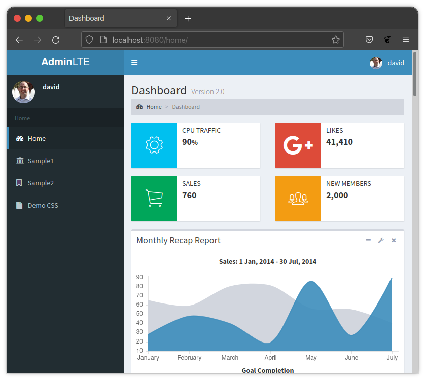
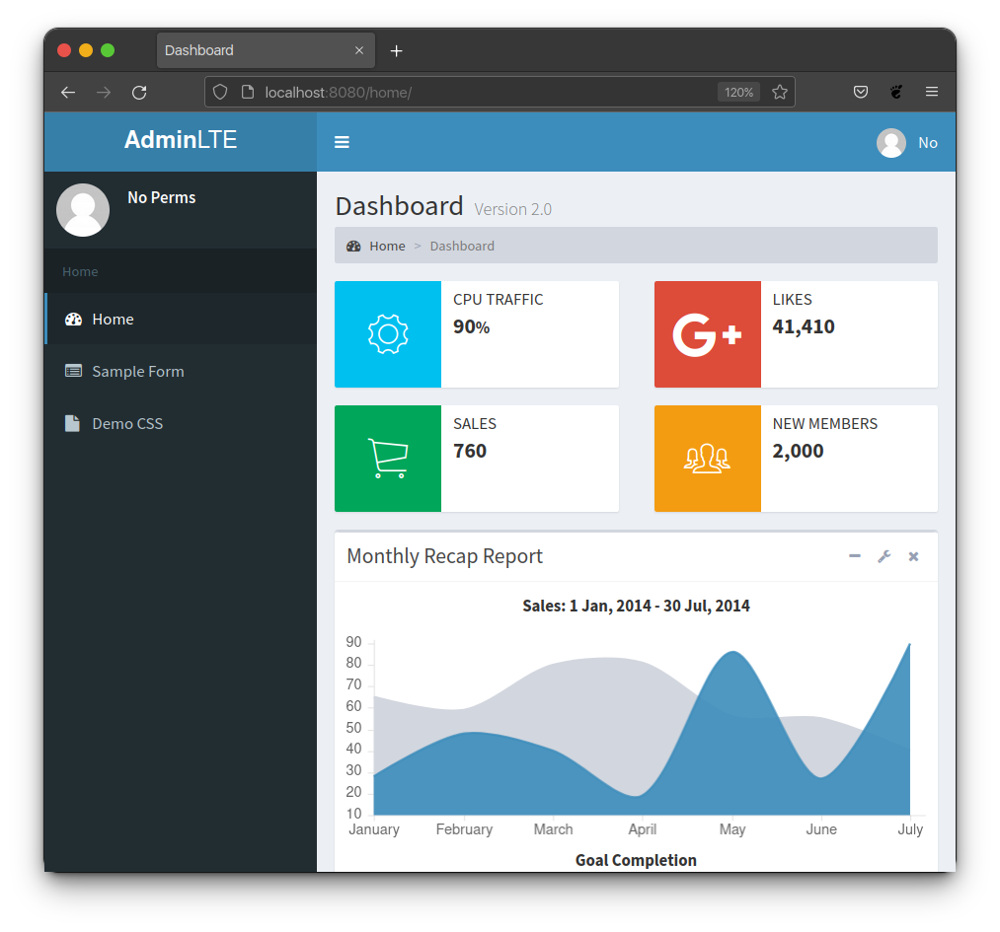
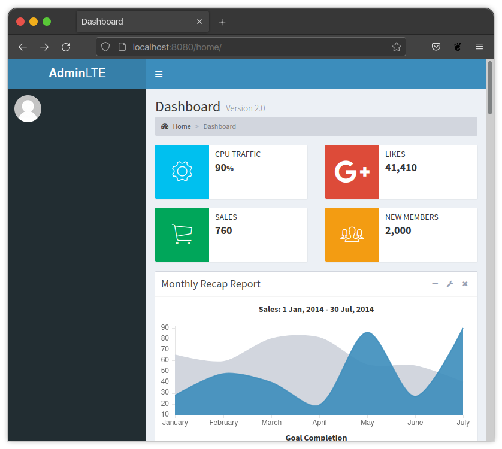
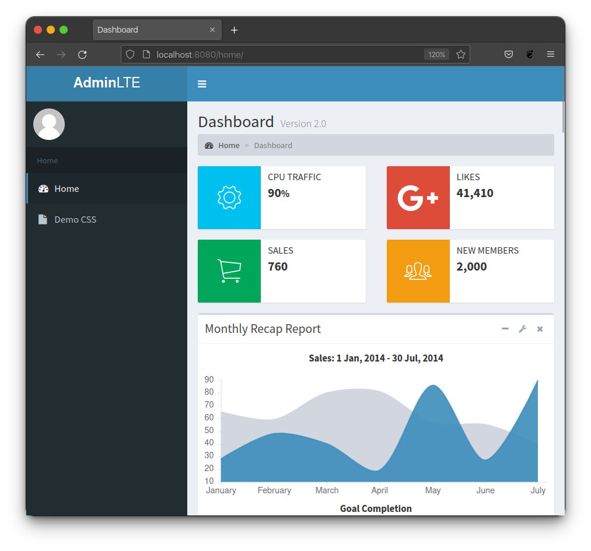
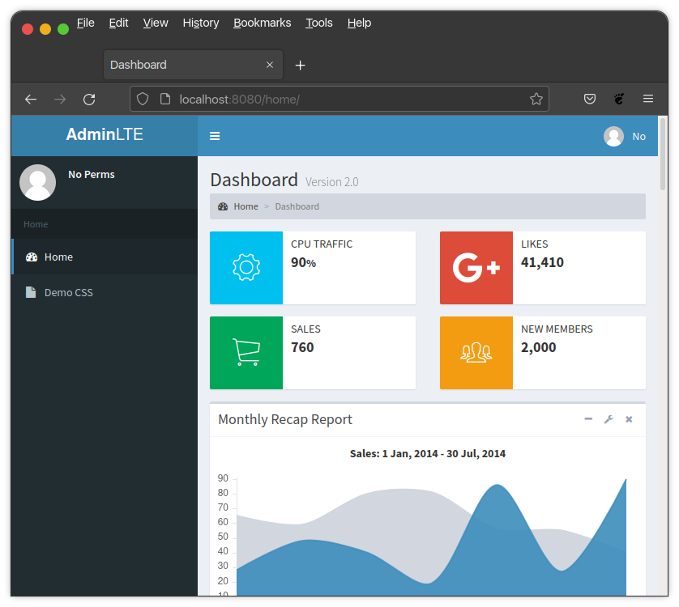
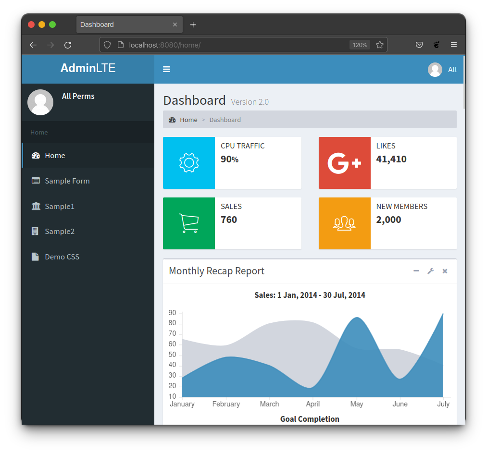

Authorizing Class Based Views
*****************************

Mixins
======

There are two mixins provided by Django-AdminLTE-2 that can be used on a
class-based view to control whether a user:

* Has access to both the protected view.
* Can see links in the sidebar, relating to the protected view.

Those mixins are:

* :ref:`authorization/class_views:login required mixin` imported with

  .. code:: python

      from django_adminlte_2.mixins import LoginRequiredMixin

* :ref:`authorization/class_views:permission required mixin` imported with

  .. code:: python

      from django_adminlte_2.mixins import PermissionRequiredMixin

Login Required Mixin
--------------------

``LoginRequiredMixin``

This mixin will enforce that a user is logged into the system before they
can access the view. Django's default
`LoginRequiredMixin <https://docs.djangoproject.com/en/dev/topics/auth/default/#the-loginrequired-mixin>`_
is used behind the scenes and is only recreated in this package in order to add
the magic of automatic sidebar link rendering.

When using this mixin on a class based view, if the user in not logged in,
the user will not be able to access this view nor will they see a sidebar menu
entry that maps to this view. However, if the user is logged in,
they will see the sidebar link and have access.

.. code:: python

    from django_adminlte_2.mixins import LoginRequiredMixin

    class DemoCss(LoginRequiredMixin, View):
        """Show examples of extra-features.css"""
        def get(request):
            return render(request, 'adminlte2/demo_css.html', {
                'bootstrap_types': ['primary'],
            })

Permission Required Mixin
-------------------------

``PermissionRequiredMixin``

This mixin will enforce that a user has either all or one of a list of
permissions before they can access the view. Django's default
`PermissionRequired <https://docs.djangoproject.com/en/dev/topics/auth/default/#the-permissionrequiredmixin-mixin>`_
is used behind the scenes and is only recreated in this package in order to add
the magic of automatic sidebar link rendering.

There are two class attributes used in conjunction with this mixin.
They are called ``permission_required`` and ``permission_required_one``.
You will use one or the other depending on whether users should have all listed
permissions to gain view access, or if they only need one of many listed
permissions to gain view access.

Permission Required Attribute
^^^^^^^^^^^^^^^^^^^^^^^^^^^^^

.. code:: python

    from django_adminlte_2.mixins import PermissionRequiredMixin

    class Sample1(PermissionRequiredMixin, View):
    """Show sample1 page"""

        # Require that the user has all three permissions to access.
        permission_required = [
            'auth.add_permission',
            'auth.change_permission',
            'auth.delete_permission'
        ]

        def get(self, request, *args, **kwargs):
            return render(request, 'adminlte2/sample1.html', {})

Permission Required One Attribute
^^^^^^^^^^^^^^^^^^^^^^^^^^^^^^^^^

.. note::

    Django does not provide a similar class level attribute by default.
    This attribute and it's functionality is exclusive to this package.

.. tip::

    This class level attribute is good when you have a landing page for a
    section of your site and don't care whether the user can only read or has
    full edit permissions. Either one should allow the user to see the sidebar
    link and gain access to the landing page where further restrictions can be
    used as needed.

.. code:: python

    from django_adminlte_2.mixins import PermissionRequiredMixin

    class Sample2(PermissionRequiredMixin, View):
        """Show sample2 page"""

        # Require that the user has at least one of the three permissions to access.
        permission_required_one = [
            'auth.add_permission',
            'auth.change_permission',
            'auth.delete_permission'
        ]

        def get(self, request, *args, **kwargs):
            return render(request, 'adminlte2/sample2.html', {})

Mixin Examples
==============

Loose Mixin Example
-------------------

In this example there are five routes, views, and sidebar entries. To
demonstrate how our package works, we intentionally mess up the **Sample 2**
permissions at first, then show how to correct it. The views are as follows:

* **Home** - Should be visible to all users, regardless of being logged in or
  having permission.
* **Sample Form** - Requires simply being logged in to see and access.
* **Sample 1** - Requires two permissions (and thus being logged in) to see and
  access.
* **Sample 2** - Should require at least one of the listed permissions
  (and being logged in) to see and access. But we intentionally
  forgot to add that permission to demonstrate what will happen.
* **Demo CSS** - Should be visible to all users, regardless of being logged in
  or having permission.

.. note::

    In the below files, we have purposely made a mistake in regards to the
    **Sample2** view in order to not only demonstrate how the various files and
    contents work, but also to show what sort of side effects to expect when
    using the **Loose Policy**.

    Below this initial attempt, we correct our initial mistake and show the
    proper configuration, as well as what users will see.

.. important::

    For the purposes of this example we have turned off the global
    :ref:`authorization/policies:login required` setting and instead choose
    to define whether or not a view requires being logged in directly on
    the view rather than globally. This way we can demonstrate all three options
    available from the various mixins.

.. _loose_mixin_settings.py:

**settings.py**

.. code:: python

    # Sidebar menu definition.
    ADMINLTE2_MENU = [
        {
            'text': 'Home',
            'nodes': [
                {
                    'route': 'home',
                    'text': 'Home',
                    'icon': 'fa fa-dashboard',
                },
                {
                    'route': 'sample_form',
                    'text': 'Sample Form',
                    'icon': 'fa fa-list-alt'
                },
                {
                    'route': 'sample1',
                    'text': 'Sample1',
                    'icon': 'fa fa-bank'
                },
                {
                    'route': 'sample2',
                    'text': 'Sample2',
                    'icon': 'fa fa-building'
                },
                {
                    'route': 'demo-css',
                    'text': 'Demo CSS',
                    'icon': 'fa fa-file'
                },
            ]
        },
    ]
    # Ensures that we are using the Loose Policy.
    ADMINLTE2_USE_STRICT_POLICY = False

.. _loose_mixin_urls.py:

**urls.py**

.. code:: python

    urlpatterns = [
        path('home/', views.Home.as_view(), name="home"),
        path('sample_form/', views.sample_form, name="sample_form"),
        path('sample1/', views.Sample1.as_view(), name="sample1"),
        path('sample2/', views.Sample2.as_view(), name="sample2"),
        path('demo-css/', views.DemoCss.as_view(),name="demo-css"),
    ]

.. _loose_mixin_views.py:

**views.py**

.. code:: python

    from django.shortcuts import render
    from django.views import View
    from django_adminlte_2.mixins import (
        LoginRequiredMixin,
        PermissionRequiredMixin,
    )

    class Home(View):
        """Show home page"""
        def get(self, request, *args, **kwargs):
            return render(request, 'adminlte2/home.html', {})

    class SampleForm(LoginRequiredMixin, View):
        """Show Sample Form Page"""

        def get(request):
            form = SampleForm()
            return render(request, 'adminlte2/sample_form.html', {'form':form})

    class Sample1(PermissionRequiredMixin, View):
        """Show sample1 page"""

        permission_required = ['auth.add_permission', 'auth.view_permission',]

        def get(self, request, *args, **kwargs):
            return render(request, 'adminlte2/sample1.html', {})

    class Sample2(View):
        """Show sample2 page"""

        def get(self, request, *args, **kwargs):
            return render(request, 'adminlte2/sample2.html', {})

    class DemoCss(View):
        """Show examples of extra-features.css"""
        def get(request):
            return render(request, 'adminlte2/demo_css.html', {
                'bootstrap_types': ['primary'],
            })

**What logged out anonymous users can see and access:**

**What logged in users without correct permissions can see and access:**

**What logged in users with correct perm can see and access:**

**What logged in superusers can see and access:**

.. warning::

    We wanted to prevent the **Sample2** view from being accessed by people that
    do not have at least one permission, but forgot to add that to our view.

    Because we are using a Loose policy, everyone can see and have access this
    view. This is the **"Loose"** part of the loose policy as it defaults to
    everyone being able to see every view unless a permission is explicitly
    set on that view to add security.

Let's fix our mistake so that **Sample2** is protected and see the difference.

.. _loose_mixin_fixed_views.py:

**views.py**

Add the missing ``PermissionRequiredMixin`` mixin and the
``permission_required_one`` attribute to the Sample2 view.

.. code:: python

    class Sample2(PermissionRequiredMixin, View):
        """Show sample2 page"""

        permission_required_one = [
            'auth.add_permission',
            'auth.view_permission',
        ]

        def get(self, request, *args, **kwargs):
            return render(request, 'adminlte2/sample2.html', {})

**What logged out users can see and access now:**

**What logged in users without correct permissions can see and access now:**

**What logged in user with correct perms can see and access now:**

**What logged in superusers can see and access now:**

The pages in our example are now displaying as they're supposed to be.

Strict Mixin Example
--------------------

In this example there are five routes, views, and sidebar entries. To
demonstrate how our package works, we intentionally mess up the **Sample2** and
**Demo CSS** routes at first, then show how to correct it. The views are as
follows:

* **Home** - Should be shown to all users, regardless of being logged in or
  having permission.
* **Sample Form** - Requires simply being logged in to see and access.
* **Sample 1** - Requires two permissions (and thus being logged in) to see and
  access.
* **Sample 2** - Should require at least one of the listed permissions
  (and being logged in) to see and access. But we intentionally
  forgot to add that permission to demonstrate what will happen.
* **Demo CSS** - Should be visible to all users, regardless of being logged in
  or having permission. But we intentionally forgot to add that view's route to
  the
  :ref:`configuration/authorization:ADMINLTE2_STRICT_POLICY_WHITELIST`
  in order to demonstrate what will happen.

.. note::

    In the below files, we have purposely made a mistake in regards to the
    **Sample2** and **Demo CSS** views in order to not only demonstrate how the
    various files and contents work, but also to show what sort of side effects
    to expect when using the **Strict Policy**.

    Below this initial attempt we correct our mistake and show the proper
    configuration as well as what users will see.

.. important::

    For the purposes of this example we have turned off the global
    :ref:`authorization/policies:login required` setting and instead choose
    to define whether or not a view requires being logged in directly on
    the view rather than globally. This way we can demonstrate all three of
    the various mixins.

.. _strict_mixin_settings.py:

**settings.py**

.. code:: python

    # Sidebar menu definition.
    ADMINLTE2_MENU = [
        {
            'text': 'Home',
            'nodes': [
                {
                    'route': 'home',
                    'text': 'Home',
                    'icon': 'fa fa-dashboard',
                },
                {
                    'route': 'sample_form',
                    'text': 'Sample Form',
                    'icon': 'fa fa-list-alt'
                },
                {
                    'route': 'sample1',
                    'text': 'Sample1',
                    'icon': 'fa fa-bank'
                },
                {
                    'route': 'sample2',
                    'text': 'Sample2',
                    'icon': 'fa fa-building'
                },
                {
                    'route': 'demo-css',
                    'text': 'Demo CSS',
                    'icon': 'fa fa-file'
                },
            ]
        },
    ]
    # Ensures that we are using the Strict Policy.
    ADMINLTE2_USE_STRICT_POLICY = True

.. _strict_mixin_urls.py:

**urls.py**

.. code:: python

    urlpatterns = [
        path('home/', views.Home.as_view(), name="home"),
        path('sample_form/', views.sample_form, name="sample_form"),
        path('sample1/', views.Sample1.as_view(), name="sample1"),
        path('sample2/', views.Sample2.as_view(), name="sample2"),
        path('demo-css/', views.DemoCss.as_view(),name="demo-css"),
    ]

.. _strict_mixin_views.py:

**views.py**

.. code:: python

    from django.shortcuts import render
    from django.views import View
    from django_adminlte_2.mixins import (
        LoginRequiredMixin,
        PermissionRequiredMixin,
    )

    class Home(View):
        """Show home page"""
        def get(self, request, *args, **kwargs):
            return render(request, 'adminlte2/home.html', {})

    class SampleForm(LoginRequiredMixin, View):
        """Show Sample Form Page"""

        def get(request):
            form = SampleForm()
            return render(request, 'adminlte2/sample_form.html', {'form':form})

    class Sample1(PermissionRequiredMixin, View):
        """Show sample1 page"""

        permission_required = ['auth.add_permission', 'auth.view_permission',]

        def get(self, request, *args, **kwargs):
            return render(request, 'adminlte2/sample1.html', {})

    class Sample2(View):
        """Show sample2 page"""

        def get(self, request, *args, **kwargs):
            return render(request, 'adminlte2/sample2.html', {})

    class DemoCss(View):
        """Show examples of extra-features.css"""
        def get(request):
            return render(request, 'adminlte2/demo_css.html', {
                'bootstrap_types': ['primary'],
            })

**What logged out users can see and access:**

    .. note::

        As seen in the following screenshots, the **Home** route still works and
        the user still has access to it.

        This is because the **Home** route is one of the routes that is
        automatically included as part of the
        :ref:`configuration/authorization:adminlte2_strict_policy_whitelist`.
        For more information about the automatically included routes, check out
        the :ref:`authorization/policies:strict policy` section.

**What logged in users without correct permissions can see and access:**

**What logged in users with correct perm can see and access:**

**What logged in superusers can see and access:**

    .. note::
        Even though we forgot to add the **Demo CSS** route to the whitelist and
        add permissions to the **Sample2** view, the superuser can still see those
        sidebar entries and has access to those pages as superusers can always see
        everything.

.. image:: ../../img/authorization/strict_policy_superuser_wrong.png
    :alt: Strict Policy with superuser and missed mixin/setting.

.. warning::

    We wanted the **Demo CSS** view to be visible and accessible to all users.
    But as configured, it is not visible to anyone (other than superusers).
    In addition, the **Sample2** page is also not visible to anyone
    (other than superusers).

    Because we are using the Strict Policy, all sidebar menu links are hidden
    by default. This is the **"Strict"** part of the Strict Policy as it
    defaults to everyone not being able to see every sidebar menu link unless a
    mixin is explicitly used on that view or the route for that view is
    added to the
    :ref:`configuration/authorization:ADMINLTE2_STRICT_POLICY_WHITELIST`.

    In the case of the **Demo CSS** view, we add the route to the
    ``ADMINLTE2_STRICT_POLICY_WHITELIST`` as we don't want to require
    any criteria to see it and instead want to ensure that everyone will be
    able to see the link and page regardless of their permissions or being
    logged in.

    In the case of **Sample2**, we are going to add the missing permissions that
    we accidentally omitted earlier.

Let's fix our mistake so that **Demo CSS** and **Sample2** are visible to who
they are supposed to be.

.. _strict_mixin_fixed_settings.py:

**settings.py**

Add the missing whitelist to the settings file and ensure it includes the
demo-css route.

.. code:: python

    # Lists the routes that do not need permissions to be seen by all users.
    ADMINLTE2_STRICT_POLICY_WHITELIST = ['demo-css']

.. _strict_mixin_fixed_views.py:

**views.py**

Add the missing ``PermissionRequiredMixin`` mixin and
``permission_required_one`` attribute to the Sample2 view.

.. code:: python

    class Sample2(PermissionRequiredMixin, View):
        """Show sample2 page"""

        permission_required_one = [
            'auth.add_permission',
            'auth.view_permission',
        ]

        def get(self, request, *args, **kwargs):
            return render(request, 'adminlte2/sample2.html', {})

**What logged out users can see and access now:**

**What logged in users without correct permissions can see and access now:**

**What logged in user with correct perms can see and access now:**

**What logged in superusers can see and access now:**

The pages in our example are now displaying as they're supposed to be.
