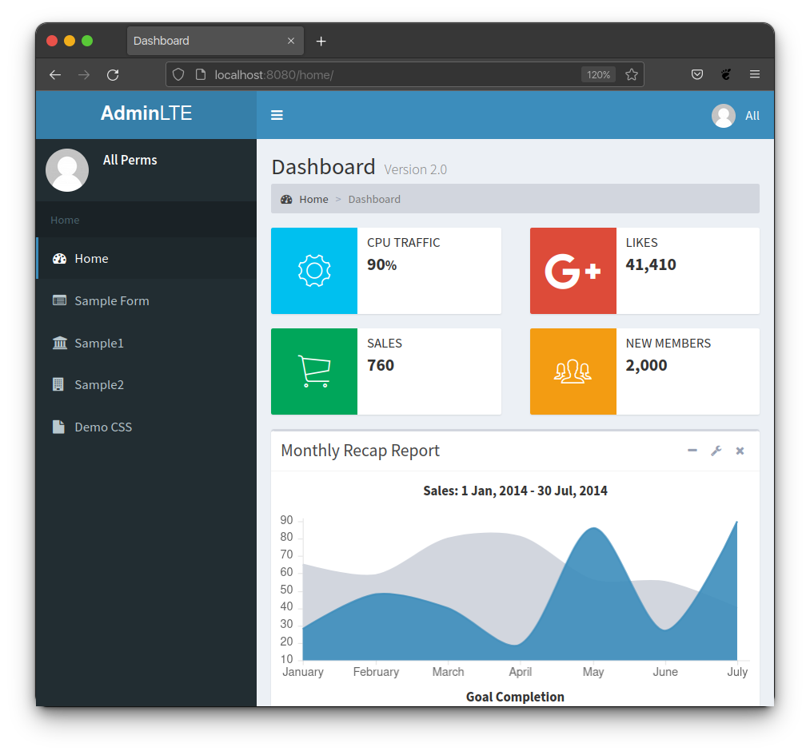
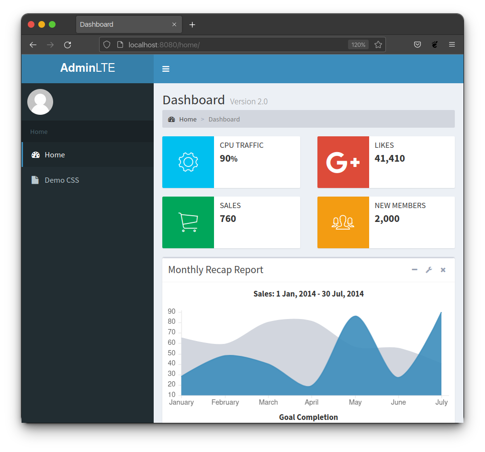
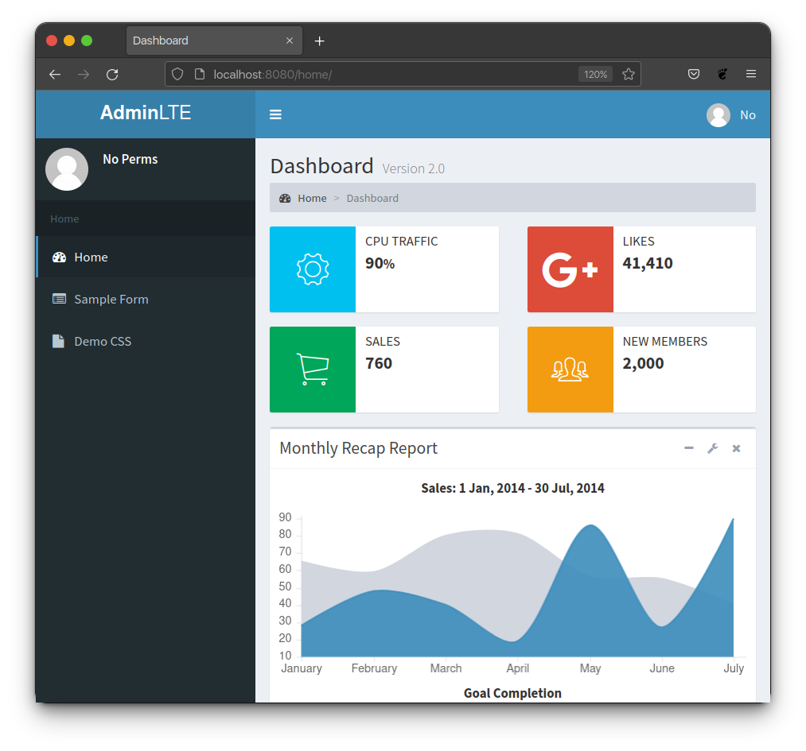

Authorizing Function Based Views
********************************

Decorators
==========

There are three decorators provided by Django-AdminLTE2-PDQ that can be used on a
function-based view to control whether a user:

* Has access to the decorated view.
* Can see links in the sidebar, relating to the decorated view.

Those decorators are:

* :ref:`authorization/function_views:login required decorator` imported with

  .. code:: python

      from adminlte2_pdq.decorators import login_required

* :ref:`authorization/function_views:permission required decorator` imported
  with

  .. code:: python

      from adminlte2_pdq.decorators import permission_required

* :ref:`authorization/function_views:permission required one decorator` imported
  with

  .. code:: python

      from adminlte2_pdq.decorators import permission_required_one

Login Required Decorator
------------------------

``@login_required``

This decorator will enforce that a user is logged into the system before they
can access the view. Django's default
`login_required <https://docs.djangoproject.com/en/dev/topics/auth/default/#the-login-required-decorator>`_
decorator is used behind the scenes and is only recreated in this package
to add the magic of automatic sidebar link rendering.

When using this decorator on a function view, if the user is not logged in,
the user will not be able to access this view, nor will they see a sidebar menu
entry that maps to this view. However, if the user is logged in,
they will see the sidebar link and have access.

.. code:: python

    from adminlte2_pdq.decorators import login_required

    @login_required
    def demo_css(request):
        """Show examples of extra-features.css"""
        return render(request, 'adminlte2/demo_css.html', {
            'bootstrap_types': ['primary'],
        })

Permission Required Decorator
-----------------------------

``@permission_required``

This decorator will list all required permissions for the view. Django's default
`permission_required <https://docs.djangoproject.com/en/dev/topics/auth/default/#the-permission-required-decorator>`_
decorator is used behind the scenes and is only recreated in this package
to add the magic of automatic sidebar link rendering.

When using this decorator on a function view, if the user does not have all of
the permissions that we define in this decorator, the user will not be able to
access this view, nor will they see a sidebar menu entry that maps to this view.
However, if the user does have all of these permissions, they will see the
sidebar link and have access.

.. code:: python

    from adminlte2_pdq.decorators import permission_required

    @permission_required([
        'auth.add_group',
        'auth.change_group',
        'auth.delete_group'
    ])
    def sample1(request):
        """Show default sample1 page"""
        return render(request, 'adminlte2/sample1.html', {})

Permission Required One Decorator
---------------------------------

``@permission_required_one``

This decorator will list the permissions that a user must have at least one
of to be able to access the view and see the associated sidebar link.

.. note::

    Django does not provide a similar decorator by default. This decorator is
    exclusive to this package.

When using this decorator on a function view, if the user does not have at
least one of the permissions that we define on this decorator, the user will
not be able to access this view, nor will they see a sidebar menu entry that
maps to this view. However, if the user has at least one of any of these
permissions, they will see the sidebar link and have access.

.. tip::

    This decorator is good when you have a landing page for a section of
    your site and don't care whether the user can only read or has full edit
    permissions. Either one should allow the user to see the sidebar link and
    gain access to the landing page where further restrictions can be used
    as needed.

.. code:: python

    from adminlte2_pdq.decorators import permission_required_one

    @permission_required_one([
        'auth.add_permission',
        'auth.change_permission',
        'auth.delete_permission'
    ])
    def sample2(request):
        """Show default sample2 page"""
        return render(request, 'adminlte2/sample2.html', {})

Decorator Examples
==================

Loose Decorator Example
-----------------------

In this example, there are five routes, views, and sidebar entries. To
demonstrate how our package works, we intentionally mess up the **Sample 2**
permissions at first, then show how to correct it. The views are as follows:

* **Home** - Should be visible to all users regardless of being logged in or
  having permission.
* **Sample Form** - Requires simply being logged in to see and access.
* **Sample 1** - Requires two permissions (and thus being logged in) to see and
  access.
* **Sample 2** - Should require at least one of the listed permissions
  (and be logged in) to see and access. But we intentionally
  forgot to add that permission to demonstrate what will happen.
* **Demo CSS** - Should be visible to all users regardless of being logged in
  or having permission.

Below is all the code required to generate these views.

.. note::

    In the below files, we have purposely made a mistake in regards to the
    **Sample2** view to not only demonstrate how the various files and
    contents work, but also to show what sort of side effects to expect when
    using the **Loose Policy**.

    Below this initial attempt, we correct our mistake and show the proper
    configuration, as well as what users will see.

.. important::

    For this example, we have turned off the global
    :ref:`authorization/policies:login required` setting and instead choose
    to define whether or not a view requires being logged in directly on
    the view rather than globally. This way we can demonstrate all three of
    the various decorators.

.. _loose_decorator_settings.py:

**settings.py**

.. code:: python

    # Sidebar menu definition.
    ADMINLTE2_MENU = [
        {
            'text': 'Home',
            'nodes': [
                {
                    'route': 'home',
                    'text': 'Home',
                    'icon': 'fa fa-dashboard',
                },
                {
                    'route': 'sample_form',
                    'text': 'Sample Form',
                    'icon': 'fa fa-list-alt'
                },
                {
                    'route': 'sample1',
                    'text': 'Sample1',
                    'icon': 'fa fa-bank'
                },
                {
                    'route': 'sample2',
                    'text': 'Sample2',
                    'icon': 'fa fa-building'
                },
                {
                    'route': 'demo-css',
                    'text': 'Demo CSS',
                    'icon': 'fa fa-file'
                },
            ]
        },
    ]
    # Ensures that we are using the Loose Policy.
    ADMINLTE2_USE_STRICT_POLICY = False

.. _loose_decorator_urls.py:

**urls.py**

.. code:: python

    urlpatterns = [
        path('home/', views.home, name="home"),
        path('sample_form/', views.sample_form, name="sample_form"),
        path('sample1/', views.sample1, name="sample1"),
        path('sample2/', views.sample2, name="sample2"),
        path('demo-css/', views.demo_css, name="demo-css"),
    ]

.. _loose_decorator_views.py:

**views.py**

.. code:: python

    from django.shortcuts import render
    from adminlte2_pdq.decorators import (
        login_required,
        permission_required,
        permission_required_one,
    )

    def home(request):
        """Show home page"""
        return render(request, 'adminlte2/home.html', {})

    @login_required()
    def sample_form(request):
        """Show sample form"""
        form = SampleForm()
        return render(request, 'adminlte2/sample_form.html', {'form':form})

    @permission_required(['auth.add_permission', 'auth.view_permission',])
    def sample1(request):
        """Show sample1 page"""
        return render(request, 'adminlte2/sample1.html', {})

    def sample2(request):
        """Show sample2 page"""
        return render(request, 'adminlte2/sample2.html', {})

    def demo_css(request):
    """Show examples of extra-features.css"""
    return render(request, 'adminlte2/demo_css.html', {
        'bootstrap_types': ['primary'],
    })

**What logged out anonymous users can see and access:**

**What logged in users without correct permissions can see and access:**

.. image:: ../../img/authorization/loose_policy_no_perms_wrong.png
    :alt: Loose Policy with no permission user and missed decorator.

**What logged in users with correct permissions can see and access:**

**What logged in superusers can see and access:**

.. image:: ../../img/authorization/loose_policy_superuser_wrong.png
    :alt: Loose Policy with superuser and missed decorator.

.. warning::

    We wanted to prevent the **Sample2** view from being accessed by people that
    do not have at least one permission, but forgot to add that to our view.

    Because we are using a Loose policy, everyone can see and have access to
    this view. This is the **"Loose"** part of the loose policy, as it defaults
    to everyone being able to see every view unless a decorator is explicitly
    used on that view.

Let's fix our mistake so that **Sample2** is protected and see the difference.

.. _loose_decorator_fixed_views.py:

**views.py**

Add the missing ``permission_required_one`` decorator to the Sample2 view.

.. code:: python

    @permission_required_one(['auth.add_permission', 'auth.view_permission',])
    def sample2(request):
        """Show sample2 page"""
        return render(request, 'adminlte2/sample2.html', {})

**What logged out users can see and access now:**

**What logged in users without correct permissions can see and access now:**

**What logged in users with correct permissions can see and access now:**

.. image:: ../../img/authorization/loose_policy_with_perms_correct.png
    :alt: Loose Policy with full permission user and correct decorator.

**What logged in superusers can see and access now:**

.. image:: ../../img/authorization/loose_policy_superuser_correct.png
    :alt: Loose Policy with superuser and correct decorator.

The pages in our example are now displaying as they're supposed to be.

Strict Decorator Example
------------------------

In this example, there are five routes, views, and sidebar entries. To
demonstrate how our package works, we intentionally mess up the **Sample2** and
**Demo CSS** routes at first, then show how to correct them. The views are as
follows:

* **Home** - Should be visible to all users, regardless of being logged in or
  having permission.
* **Sample Form** - Requires simply being logged in to see and access.
* **Sample 1** - Requires two permissions (and thus being logged in) to see and
  access.
* **Sample 2** - Should require at least one of the listed permissions
  (and be logged in) to see and access. But we intentionally
  forgot to add that permission to demonstrate what will happen.
* **Demo CSS** - Should be visible to all users, regardless of being logged in
  or having permission. But we intentionally forgot to add that view's route to
  the
  :ref:`configuration/authorization:ADMINLTE2_STRICT_POLICY_WHITELIST`
  to demonstrate what will happen.

Below is all the code required to generate these views.

.. note::

    In the below files, we have purposely made a mistake in regards to the
    **Sample2** and **Demo CSS** views to not only demonstrate how the
    various files and contents work, but also to show what sort of side effects
    to expect when using the **Strict Policy**.

    Below this initial attempt, we correct our mistake and show the proper
    configuration as well as what users will see.

.. important::

    For this example, we have turned off the global
    :ref:`authorization/policies:login required` setting and instead choose
    to define whether or not a view requires being logged in directly on
    the view rather than globally. This way we can demonstrate all three of
    the various decorators.

.. _strict_decorator_settings.py:

**settings.py**

.. code:: python

    # Sidebar menu definition.
    ADMINLTE2_MENU = [
        {
            'text': 'Home',
            'nodes': [
                {
                    'route': 'home',
                    'text': 'Home',
                    'icon': 'fa fa-dashboard',
                },
                {
                    'route': 'sample_form',
                    'text': 'Sample Form',
                    'icon': 'fa fa-list-alt'
                },
                {
                    'route': 'sample1',
                    'text': 'Sample1',
                    'icon': 'fa fa-bank'
                },
                {
                    'route': 'sample2',
                    'text': 'Sample2',
                    'icon': 'fa fa-building'
                },
                {
                    'route': 'demo-css',
                    'text': 'Demo CSS',
                    'icon': 'fa fa-file'
                },
            ]
        },
    ]
    # Ensures that we are using the Strict Policy.
    ADMINLTE2_USE_STRICT_POLICY = True

.. _strict_decorator_urls.py:

**urls.py**

.. code:: python

    urlpatterns = [
        path('home/', views.home, name="home"),
        path('sample_form/', views.sample_form, name="sample_form"),
        path('sample1/', views.sample1, name="sample1"),
        path('sample2/', views.sample2, name="sample2"),
        path('demo-css/', views.demo_css, name="demo-css"),
    ]

.. _strict_decorator_views.py:

**views.py**

.. code:: python

    from django.shortcuts import render
    from adminlte2_pdq.decorators import (
        login_required,
        permission_required,
        permission_required_one,
    )

    def home(request):
        """Show home page"""
        return render(request, 'adminlte2/home.html', {})

    @login_required()
    def sample_form(request):
        """Show sample form"""
        form = SampleForm()
        return render(request, 'adminlte2/sample_form.html', {'form':form})

    @permission_required(['auth.add_permission', 'auth.view_permission',])
    def sample1(request):
        """Show sample1 page"""
        return render(request, 'adminlte2/sample1.html', {})

    def sample2(request):
        """Show sample2 page"""
        return render(request, 'adminlte2/sample2.html', {})

    def demo_css(request):
    """Show examples of extra-features.css"""
    return render(request, 'adminlte2/demo_css.html', {
        'bootstrap_types': ['primary'],
    })

**What logged out users can see and access:**

    .. note::

        As seen in the following screenshots, the **Home** route still works and
        the user still has access to it.

        This is because the **Home** route is one of the routes that are
        automatically included as part of the
        :ref:`configuration/authorization:adminlte2_strict_policy_whitelist`.

.. image:: ../../img/authorization/strict_policy_anonymous_wrong.png
    :alt: Strict Policy with anonymous user and missed decorator and setting.

**What logged in users without correct permissions can see and access:**

.. image:: ../../img/authorization/strict_policy_no_perms_wrong.png
    :alt: Strict Policy with no permission user and missed decorator/setting.

**What logged in users with correct perm can see and access:**

.. image:: ../../img/authorization/strict_policy_with_perms_wrong.png
    :alt: Strict Policy with full permission user and missed decorator/setting.

**What logged in superusers can see and access:**

    .. note::
        Even though we forgot to add the **Demo CSS** route to the whitelist and
        add permissions to the **Sample2** view, the superuser can still see those
        sidebar entries and has access to those pages as superusers can always see
        everything.

.. image:: ../../img/authorization/strict_policy_superuser_wrong.png
    :alt: Strict Policy with superuser and missed decorator/setting.

.. warning::

    We wanted the **Demo CSS** view to be visible and accessible to all users.
    But as configured, it is not visible to anyone. In addition, the
    **Sample2** page is also not visible to anyone.

    Because we are using the Strict Policy, all sidebar menu links are hidden
    by default. This is the **"Strict"** part of the Strict Policy as it
    defaults to everyone not being able to see every sidebar menu link unless a
    decorator is explicitly used on that view or the route for that view is
    added to the
    :ref:`configuration/authorization:ADMINLTE2_STRICT_POLICY_WHITELIST`.

    In the case of the **Demo CSS** view, we add the route to the
    ``ADMINLTE2_STRICT_POLICY_WHITELIST`` as we don't want to require
    any criteria to see it and instead want to ensure that everyone will be
    able to see the link and page regardless of their permissions or being
    logged in.

    In the case of **Sample2**, we are going to add the missing permissions that
    we accidentally omitted earlier.

Let's fix our mistake so that **Demo CSS** and **Sample2** are visible to those
who they are supposed to be.

.. _strict_decorator_fixed_settings.py:

**settings.py**

Add the missing whitelist to the settings file and ensure it includes the
demo-css route.

.. code:: python

    # Lists the routes that do not need permissions to be seen by all users.
    ADMINLTE2_STRICT_POLICY_WHITELIST = ['demo-css']

.. _strict_decorator_fixed_views.py:

**views.py**

Add the missing ``permission_required_one`` decorator to the Sample2 view.

.. code:: python

    @permission_required_one(['auth.add_permission', 'auth.view_permission',])
    def sample2(request):
        """Show sample2 page"""
        return render(request, 'adminlte2/sample2.html', {})

**What logged out users can see and access now:**

.. image:: ../../img/authorization/strict_policy_anonymous_correct.png
    :alt: Strict Policy with anonymous user and correct decorator/setting.

**What logged in users without correct permissions can see and access now:**

**What logged in users with correct permissions can see and access now:**

.. image:: ../../img/authorization/strict_policy_with_perms_correct.png
    :alt: Strict Policy with full permission user and correct decorator/setting.

**What logged in superusers can see and access now:**

.. image:: ../../img/authorization/strict_policy_superuser_correct.png
    :alt: Strict Policy with superuser and correct decorator/setting.

The pages in our example are now displaying as they're supposed to be.
