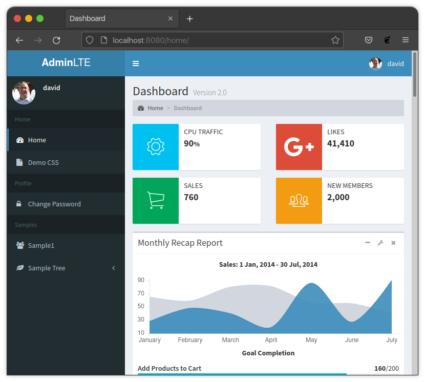

.. Django-AdminLTE2-PDQ documentation master file, created by
   sphinx-quickstart on Sat Mar  6 10:30:55 2021.
   You can adapt this file completely to your liking, but it should at least
   contain the root `toctree` directive.

Welcome to Django-AdminLTE2-PDQ's documentation!
************************************************

**Django-AdminLTE2-PDQ** is a `Django <https://www.djangoproject.com/>`_ app
that takes all of the work out of making a beautiful and functional web
application pretty darn quickly (PDQ) using the
`AdminLTE2 <https://adminlte.io/themes/AdminLTE/index2.html>`_
theme.

**This app has two main parts**:

* `AdminLTE2 Styled <https://adminlte.io/themes/AdminLTE/index2.html>`_
  Django templates, for a reliable front-end styling out of the box.

* Expanded decorator/mixin auth logic, for quick and easy handling of all
  your permission needs.

Additionally, this app provides additional template filters, template tags,
and more, to aid in the rapid development of a site.

**Features include**:

* Styled with `AdminLTE2 <https://adminlte.io/themes/AdminLTE/index2.html>`_.

* Automatic
  `Django Admin <https://docs.djangoproject.com/en/dev/ref/contrib/admin/>`_
  styling that matches AdminLTE2.

* Three permission/authentication modes:

  * "**Loose**" Mode - The default Django handling, and thus the project default.
    All views are accessible to all users, until decorators/mixins are added
    to enforce more strict handling.

  * "**Login Required**" Mode - Defaults all views to be slightly more secure as
    their default behavior. Unless decorators/mixins specify otherwise, all
    views will require user login in order to access.

  * "**Strict**" Mode - Defaults all views to be the most strict possible. Unless
    decorators/mixins specify otherwise, all views require permissions in order
    to access.

* Customizable web page templates:

    * Built-in templates split into reasonable block sections, to help
      facilitate any content your site needs.

    * Template filters to aid in manual styling.

    * Template tags for form rendering that matches AdminLTE2.

    * Automatic form error and message styling.

* Easy sidebar menu creation and customization:

  * Views can easily be added to the sidebar with just a few lines of code.

  * Automatic menu link hiding based on user permissions to views.

    * Aka, sidebar links can be customized to only be visible upon meeting
      login or permission criteria.

  * Automatic inclusion of Admin links in the sidebar.

* `Font Awesome 4 <https://fontawesome.com/v4/icons/>`_
  & `Font Awesome 5 <https://fontawesome.com/v5/search>`_ integration.

* Highly configurable functionality, via project
  `Django settings variables <https://docs.djangoproject.com/en/dev/topics/settings/>`_.

.. toctree::
   :maxdepth: 3
   :caption: Getting Started

   quickstart

.. toctree::
   :maxdepth: 3
   :caption: Templates

   templates/templates
   templates/template_filters
   templates/template_tags
   templates/forms
   templates/fields

.. toctree::
   :maxdepth: 3
   :caption: Menu

   menu/general_information
   menu/building_blocks
   menu/advanced
   menu/admin
   menu/examples

.. toctree::
   :maxdepth: 3
   :caption: Configuration

   configuration/home
   configuration/menu
   configuration/admin
   configuration/authorization
   configuration/form

.. toctree::
   :maxdepth: 3
   :caption: Authentication & Authorization

   authorization/policies
   authorization/function_views
   authorization/class_views

.. toctree::
   :maxdepth: 3
   :caption: Misc

   demo_css
   api_reference

   version_history

Indices and tables
******************

* :ref:`genindex`
* :ref:`modindex`
* :ref:`search`
