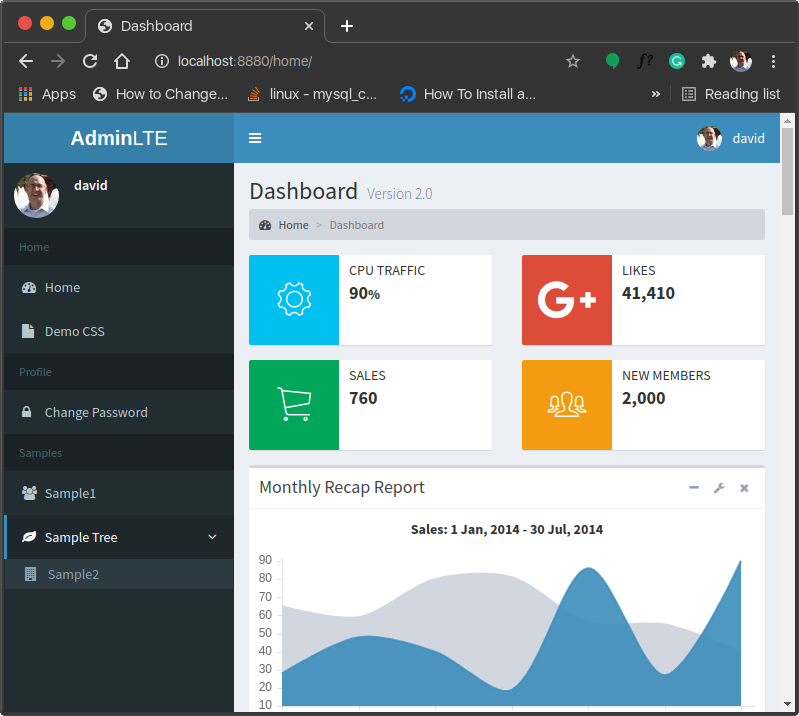
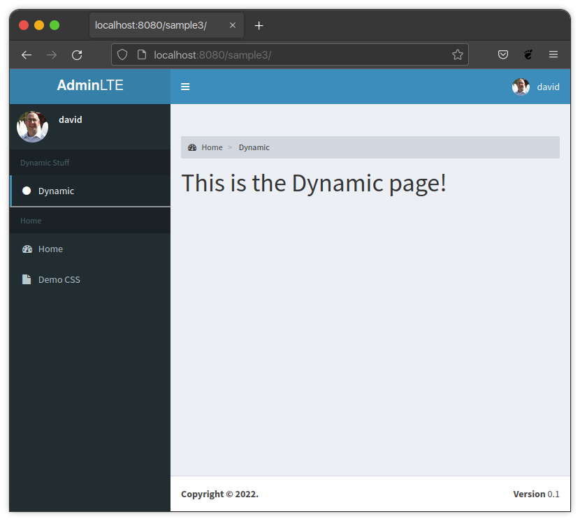

Menu
====

General information
-------------------

The full sidebar is rendered by parsing the contents of three settings.
Each sidebar menu definition consists of a list of dictionary building blocks.
Each building block will render out either a section, node, or a tree.
A tree will consist of additional sections, nodes, or trees.

Definition Location
-------------------

Settings
^^^^^^^^
The sidebar building blocks can be defined in one or a combination
of the three following settings:

* ``ADMINLTE2_MENU_FIRST``
* ``ADMINLTE2_MENU``
* ``ADMINLTE2_MENU_LAST``

Defining one of these sections in the settings file is best when the
sidebar content is static and the only thing that may change is the
visibility of entries based on whether or not a user is authorized
to see that particular thing.

For information on how to show/hide nodes based on authorization
see the :doc:`authorization` section.

If you need a more dynamic menu that is database driven based on
information in the database that changes often, see the next
advanced_ section.

Advanced
^^^^^^^^

If you need your menu, or part of your menu to be dynamic and generated
from data in the database on each page load you can send the dynamic
menu to the template in the context. The context version will override
the settings version.

A practical use for this would be to define the main menu using
the ``ADMINLTE2_MENU`` setting, and then defining dynamic content
for the page via the context for a template using the
``ADMINLTE2_MENU_FIRST`` key.

See the `Advanced Settings and Context Example`_ section for a demonstration
on how to do this.

Building Blocks
---------------

The menu consists of 3 types of building blocks described below.

Sections
^^^^^^^^

A section will consist of section text and any trees or nodes that
make up the remaining parts of the section. Neither the text nor the
nodes are required, but having neither does not make sense. You can
have text with no nodes if you only want a header. You can have nodes
without text if you do not want a header for you nodes. The most
common implementation will consist of defining both.

Section Fields
""""""""""""""
**text**

A string representing the section text that a user will see.

:Key: ``text``
:Type: ``string``
:Required: ``False``

**nodes**

A list of node dictionaries or trees that will render out each
sidebar link, or a tree that contains sidebar links.

:Key: ``nodes``
:Type: ``list``
:Required: ``False``

Section Example
"""""""""""""""
.. code:: python

    {
        'text': 'Home',
        'nodes': []
    }

Node
^^^^

A node is a python dictionary that will create a link with a
name and an icon in the sidebar.

Node Fields
"""""""""""

**route**

A valid django route. If you are scaffolding your menu out and do
not have a valid route yet, just enter a ``#`` as a place holder.

:Key: ``route``
:Type: ``string``
:Required: ``True``

**text**

A string representing what will be rendered for the user to see.

:Key: ``text``
:Type: ``string``
:Required: ``False``

**icon**

Either a Font-Awesome 4 or 5 set of CSS classes. All required
to make the icon show up are required.

:Key: ``icon``
:Type: ``string``
:Required: ``False``

Node Example
""""""""""""
.. code:: python

    {
        'route': 'django_adminlte_2:home',
        'text': 'Home',
        'icon': 'fa fa-dashboard',
    }

Tree
^^^^

A tree is a python dictionary that will create a link with a
name and icon in the sidebar. In addition, the tree will contain
other nodes that will be links under the tree heading.

Tree Fields
"""""""""""

**text**

A string representing what will be rendered for the user to see.

:Key: ``text``
:Type: ``string``
:Required: ``False``

**icon**

Either a Font-Awesome 4 or 5 set of CSS classes. All required
to make the icon show up are required.

:Key: ``icon``
:Type: ``string``
:Required: ``False``

**nodes**

A list of node dictionaries or trees that will render out each
sidebar link, or a tree that contains sidebar links.

:Key: ``nodes``
:Type: ``list``
:Required: ``False``

Tree Example
""""""""""""
.. code:: python

    {
        'text': 'Sample Tree',
        'icon': 'fa fa-leaf',
        'nodes': [],
    },

Tree Example with a Node
""""""""""""""""""""""""
.. code:: python

    {
        'text': 'Sample Tree',
        'icon': 'fa fa-leaf',
        'nodes': [
            {
                'route': 'django_adminlte_2:sample2',
                'text': 'Sample2',
                'icon': 'fa fa-building',
            },
        ],
    },

Full Examples
-------------

Simple Settings Example
^^^^^^^^^^^^^^^^^^^^^^^

**settings.py**

.. code:: python

    ADMINLTE2_MENU = [
        {
            'text': 'Home',
            'nodes': [
                {
                    'route': 'django_adminlte_2:home',
                    'text': 'Home',
                    'icon': 'fa fa-dashboard',
                },
                {
                    'route': 'django_adminlte_2:demo-css',
                    'text': 'Demo CSS',
                    'icon': 'fa fa-file'
                },
            ]
        },
        {
            'text': 'Profile',
            'nodes': [
                {
                    'route': 'password_change',
                    'text': 'Change Password',
                    'icon': 'fa fa-lock'
                }
            ]
        },
        {
            'text': 'Samples',
            'nodes': [
                {
                    'route': 'django_adminlte_2:sample1',
                    'text': 'Sample1',
                    'icon': 'fa fa-group',
                },
                {
                    'text': 'Sample Tree',
                    'icon': 'fa fa-leaf',
                    'nodes': [
                        {
                            'route': 'django_adminlte_2:sample2',
                            'text': 'Sample2',
                            'icon': 'fa fa-building',
                        },
                    ],
                },
            ],
        },
    ]

Advanced Settings and Context Example
^^^^^^^^^^^^^^^^^^^^^^^^^^^^^^^^^^^^^

**settings.py**

.. code:: python
    :name: settings.py

    ADMINLTE2_MENU = [
        {
            'text': 'Home',
            'nodes': [
                {
                    'route': 'django_adminlte_2:home',
                    'text': 'Home',
                    'icon': 'fa fa-dashboard',
                },
                {
                    'route': 'django_adminlte_2:demo-css',
                    'text': 'Demo CSS',
                    'icon': 'fa fa-file'
                },
            ]
        },
    ]

**urls.py**

.. code:: python
    :name: urls.py

    urlpatterns = [
        ...
        path('sample3/', views.sample3, name="sample3"),
        ...
    ]

**views.py**

.. code:: python
    :name: views.py

    def sample3(request):
        """Show default sample3 page"""

        dynamic_content = [
            {
                'text': 'Dynamic Stuff',
                'nodes': [
                    {
                        'route': '#',
                        'text': 'Dynamic1',
                        'icon': 'fa fa-circle',
                    },
                ]
            },
        ]

        return render(
            request,
            'adminlte2/sample3.html',
            {
                'ADMINLTE2_MENU_FIRST': dynamic_content
            }
        )

