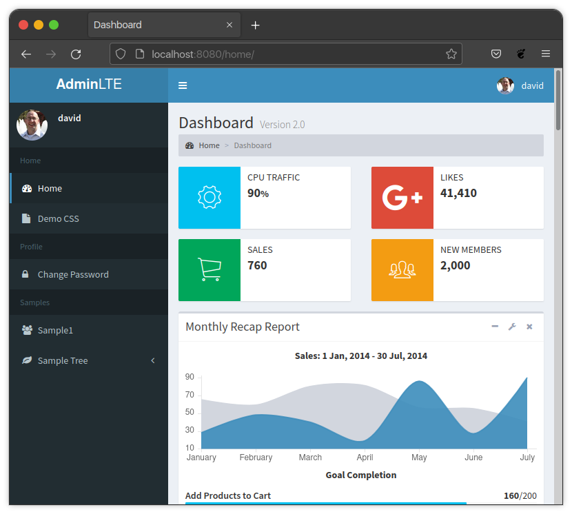

Menu
****

General information
===================

In its most basic configuration, the full sidebar is rendered by parsing the
contents of a Django setting called :ref:`configuration:adminlte2_menu`.
This setting will contain a menu definition consisting of reusable building
blocks in the form of either a
section_, separator_, node_, or tree_.
In the case of a tree, more building blocks are used to define the contents of
the tree.

Defining the menu in the settings file is best when the
sidebar content is static and the only thing that may change is the
visibility of entries based on whether or not a user is authorized
to see that particular thing.

For information on how to show/hide nodes based on authorization
see the :doc:`authorization` page.

In addition to defining the menu in the settings, it is also possible to pass
the menu definition to each template via the context. In this situation, the
context version will take precedence over the settings version.
This is great if you need to have your menu generated dynamically from data in
the database or a combination of static and dynamic entries.
See the :ref:`menu:advanced` section for more information regarding dynamic
menu generation and how to create a menu that consists of a combination of both
static and dynamic content.

Adminlte will also automatically add menu entries for the entire admin.
This will consist of entries for each app as well as each model.
By default, these admin menu entries can only be seen when the user is on an
admin page. But, this can be customized via some configuration settings defined
in the Django settings.
See the :ref:`configuration:menu configuration`
and :ref:`configuration:admin configuration` sections of
the :doc:`configuration` page for more information about those options.
Additionally, the icons used for each admin menu entry can be customized.
See the :ref:`menu:admin menu` section for information on how to customize the
admin menu.

Building Blocks
===============

The menu is built using a combination of the following 4 types of
building blocks described below.

Section
-------

A section will consist of section text and any nodes that
make up the remaining parts of the section. Neither the text nor the
nodes are required.
You can have no text and no nodes if you just want some extra space in the
sidebar between other sections.
You can have text with no nodes if you only want a header.
You can have nodes without text if you want a blank header for you nodes.
The most common implementation however will consist of defining both.

Section Keys
^^^^^^^^^^^^
**text**

A string representing the section text that a user will see.

:Key: ``text``
:Type: ``string``
:Required: ``False``

**nodes**

A list of node_ dictionaries that will render out each sidebar link,
and/or a tree_ definition that contains additional nodes to render links.

:Key: ``nodes``
:Type: ``list``
:Required: ``False``

Section Example
^^^^^^^^^^^^^^^
.. code:: python

    {
        'text': 'Home',
        'nodes': []
    }

Separator
---------

A section with no text or nodes, but a key called separator that is set to
True. This will render out a physical line separating one section from the
next.

**text**

A blank string.

:Key: ``text``
:Type: ``string``
:Required: ``True``

**nodes**

An empty list.

:Key: ``nodes``
:Type: ``list``
:Required: ``True``

**separator**

Defined as ``True``.

:Key: ``separator``
:Type: ``bool``
:Required: ``True``

Separator Example
^^^^^^^^^^^^^^^^^
.. code:: python

    {
        'text': '',
        'nodes': [],
        'separator': True,
    }

Node
----

A node is a python dictionary that will create a clickable sidebar link with a
name and an icon in the sidebar.

Node Keys
^^^^^^^^^

**route**

A valid django route. If you are scaffolding your menu out and do
not have a valid route yet, just enter a ``#`` as a place holder.

:Key: ``route``
:Type: ``string``
:Required: ``True``

**text**

A string representing what will be rendered for the user to see.

:Key: ``text``
:Type: ``string``
:Required: ``False``

**icon**

Either a Font-Awesome 4 or 5 set of CSS classes. All required classes needed
to make the icon show up are required to be listed. More information about
Font-Awesome can be found at:
`Font-Awesome 4 <https://fontawesome.com/v4/icons/>`_ or
`Font-Awesome 5 <https://fontawesome.com/v5/search?m=free>`_.

:Key: ``icon``
:Type: ``string``
:Required: ``False``

**hook**

An optional string representing the name of a fully qualified function that can
be called to return the text for the node that should be rendered out.
This allows the ability to dynamically create the node's text.

Adminlte will try to import the value for this key as a function and then
invoke the function and use it's results as the text for the node.
The function should return either a string that will be used for both the text
and the title text of the node, or a 2-tuple with string values for both text
and title separately.

:Key: ``hook``
:Type: ``string``
:Required: ``False``

.. tip::

    This hook is best used for making a few nodes in an otherwise static menu
    dynamic. If you need a lot of dynamic nodes, the information in the
    advanced_ section might be more useful.

**url**

An optional string representing the url for the link. It is **strongly**
recommended that you use the route key and the route for a view when defining
where a node will take the user rather than the actual URL.
However, you can specify the url key with a value of the url to take the user
to if desired.

:Key: ``url``
:Type: ``string``
:Required: ``False``

.. note::

    If you decide to use the url key, you must still provide the route key with
    a value of ``"#"`` as well since the sidebar is expecting that every node
    will have a route key.

.. tip::

    This url key is useful if you need to link to an external website rather
    than an internal link. External links must define any permissions directly
    on the node as there is no associated view to be able to pull permissions
    from. See the :doc:`authorization` page for more information.

**permissions**

An optional list of permissions as strings that the user must have all of in
order to see the node.

:Key: ``url``
:Type: ``list``
:Required: ``False``

.. warning::

    In general, you should use the functionality defined on the
    :doc:`authorization` page to add permissions to a View rather than directly
    to a node. Defining on the View will handle both hiding a node in the
    sidebar and preventing direct URL navigation without the need to
    additionally set the permissions on this node key.
    This key will **NOT** fully protect the link that the node is associated
    with.

.. tip::

    This key may be useful when you have an external link that needs to also
    be shown or hidden based on a list of permissions.

**one_of_permissions**

An optional list of permissions as strings that a user must have at least one
of in order to see the node.

:Key: ``url``
:Type: ``list``
:Required: ``False``

.. warning::

    In general, you should use the functionality defined on the
    :doc:`authorization` page to add permissions to a View rather than directly
    to a node. Defining on the View will handle both hiding a node in the
    sidebar and preventing direct URL navigation without the need to
    additionally set the permissions on this node key.
    This key will **NOT** fully protect the link that the node is associated
    with.

.. tip::

    This key may be useful when you have an external link that needs to also
    be shown or hidden based on a list of permissions.

**login_required**

An optional key on the node specifying whether a user must be logged in to
the system in order to see the node.

:Key: ``url``
:Type: ``bool``
:Required: ``False``

.. warning::

    In general, you should use the functionality defined on the
    :doc:`authorization` page to add a login required criteria to a View rather
    than directly to a node.
    Defining on the View will handle both hiding a node in the
    sidebar and preventing direct URL navigation without the need to
    additionally define that login is required on this node.
    This key will **NOT** fully protect the link that the node is associated
    with.

.. tip::

    This key may be useful when you have an external link that needs to also
    be shown or hidden based on a the user being logged in.

Node Example
^^^^^^^^^^^^
.. code:: python

    {
        'route': 'django_adminlte_2:home',
        'text': 'Home',
        'icon': 'fa fa-dashboard',
    }

Complex Node Example
^^^^^^^^^^^^^^^^^^^^

**Node**

.. code:: python

    {
        'route': '#',
        'text': 'Github',
        'icon': 'fa fa-github',
        'url': 'https://github.com',
        'hook': 'core.utils.home_link_text',
        'permissions': ['is_developer'],
    }

**core/utils.py**

.. code:: python

    def home_link_text(context):
        "Custom home link text"
        text = 'Home'
        if user.is_staff:
            text = 'Home!!!!!'
        return text

Tree
----

A tree is a python dictionary that will create an expandable entry with text
and an icon in the sidebar.
In addition, the tree will contain other nodes and/or trees as the children of
the tree.
The use of trees can make a very large menu fit into a smaller space by
utilizing the ability to expand an collapse each tree.

Tree Keys
^^^^^^^^^^^

**text**

A string representing what will be rendered for the user to see.

:Key: ``text``
:Type: ``string``
:Required: ``False``

**icon**

Either a Font-Awesome 4 or 5 set of CSS classes. All required
to make the icon show up are required.

:Key: ``icon``
:Type: ``string``
:Required: ``False``

**nodes**

A list of node dictionaries that will render out each sidebar link,
or a tree that will contain more nodes.

:Key: ``nodes``
:Type: ``list``
:Required: ``False``

Tree Example
^^^^^^^^^^^^
.. code:: python

    {
        'text': 'Sample Tree',
        'icon': 'fa fa-leaf',
        'nodes': [],
    },

Tree Example with a Node
^^^^^^^^^^^^^^^^^^^^^^^^
.. code:: python

    {
        'text': 'Sample Tree',
        'icon': 'fa fa-leaf',
        'nodes': [
            {
                'route': 'django_adminlte_2:sample2',
                'text': 'Sample2',
                'icon': 'fa fa-building',
            },
        ],
    },

Static Menu Full Example
========================

**settings.py**

.. code:: python

    ADMINLTE2_MENU = [
        {
            'text': 'Home',
            'nodes': [
                {
                    'route': 'django_adminlte_2:home',
                    'text': 'Home',
                    'icon': 'fa fa-dashboard',
                },
                {
                    'route': 'django_adminlte_2:demo-css',
                    'text': 'Demo CSS',
                    'icon': 'fa fa-file'
                },
            ]
        },
        {
            'text': 'Profile',
            'nodes': [
                {
                    'route': 'password_change',
                    'text': 'Change Password',
                    'icon': 'fa fa-lock'
                }
            ]
        },
        {
            'text': 'Samples',
            'nodes': [
                {
                    'route': 'django_adminlte_2:sample1',
                    'text': 'Sample1',
                    'icon': 'fa fa-group',
                },
                {
                    'text': 'Sample Tree',
                    'icon': 'fa fa-leaf',
                    'nodes': [
                        {
                            'route': 'django_adminlte_2:sample2',
                            'text': 'Sample2',
                            'icon': 'fa fa-building',
                        },
                    ],
                },
            ],
        },
    ]

Advanced
========

General
-------

This section will cover some advanced concepts for defining your menu.
The full menu definition technically consists of more than just what can be
defined in the settings file. In total, there are 4 main sections of the menu.
They are listed below and are rendered out in the order listed.

* ``ADMINLTE2_MENU_FIRST`` - which must be provided via a template context
  variable.
* ``ADMINLTE2_MENU`` - which is defined in the Django settings.
* ``Admin_Menu`` - which is not defined and automatically included on all admin
  pages.
* ``ADMINLTE2_MENU_LAST`` - which must be provided via a template context
  variable.

Some of the topics here will include all 4 parts, while others will focus on
only some of those parts. The advanced topics include:

* :ref:`menu:moving the menu outside settings`
* :ref:`menu:making part of the menu dynamic`
* :ref:`menu:making the entire menu dynamic`

Moving The Menu Outside Settings
--------------------------------

More than likely your menu will grower is size over time and become a little
large to be living in the settings file. Although the menu does technically
have to live in the settings, there are some workarounds that you can do so
that your menu can be defined outside the settings file while still being part
of the settings file.

The most common approach is to make a separate file that will contain your
menu definition, and then just import that definition in your settings file.

Outside Settings Example
^^^^^^^^^^^^^^^^^^^^^^^^

**my_django_project/menu.py**

.. code:: python

    ADMINLTE2_MENU = [
        {
            'text': 'Home',
            'nodes': [
                {
                    'route': 'home',
                    'text': 'Home',
                    'icon': 'fa fa-dashboard',
                },
            ]
        },
    ]

**my_django_project/settings.py**

.. code:: python

    try:
        from .menu import ADMINLTE2_MENU
    except ImportError:
        pass

Making Part Of The Menu Dynamic
-------------------------------

If you need part of your menu to be dynamic and generated
from data in the database on each page load you can send the dynamic
menu to the template via the context. The context version will override
the settings version. In addition, there are two menu sections that are
specifically meant to be dynamic and can only be delivered by a template's
context. Those sections are called
:ref:`menu:ADMINLTE2_MENU_FIRST and ADMINLTE2_MENU_LAST`.

ADMINLTE2_MENU_FIRST and ADMINLTE2_MENU_LAST
^^^^^^^^^^^^^^^^^^^^^^^^^^^^^^^^^^^^^^^^^^^^

The two new menu definitions that can be sent via a template context are
MENU_FIRST, which will render before the static menu defined in the
``ADMINLTE2_MENU`` setting and MENU_LAST, which will render out after the
admin menu section.

A practical use for this would be to define the main static menu using
the ``ADMINLTE2_MENU`` setting, and then defining dynamic content
for the page via the context for a template using the
``ADMINLTE2_MENU_FIRST`` or ``ADMINLTE2_MENU_LAST`` key.

You can see an example of this in the
:ref:`menu:Dynamic and Static Menu Full Example`

Main Menu Via Context
^^^^^^^^^^^^^^^^^^^^^

If you need the main menu to change dynamically vs just adding dynamic content
before or after the static menu, you can send a template context variable
called ``ADMINLTE2_MENU`` to the template and it will override the static one
defined in the Django settings. For an example, look at the
:ref:`menu:Dynamic and Static Menu Full Example` and pretend that rather than
using the ``ADMINLTE2_MENU_FIRST`` as the context variable in ``views.py``, you
are using ``ADMINLTE2_MENU``.

Making The Entire Menu Dynamic
------------------------------

If you need your menu to be dynamic all the time. Nothing is ever static.
You may want to consider creating a context processor that could run on
every request and send the needed menu context variable to each and every
template on every single request. More information about how to make a
context processor can be found in the
`Django docs <https://docs.djangoproject.com/en/dev/ref/templates/api/#writing-your-own-context-processors>`_
.

Dynamic and Static Menu Full Example
====================================

**settings.py**

.. code:: python
    :name: settings.py

    ADMINLTE2_MENU = [
        {
            'text': 'Home',
            'nodes': [
                {
                    'route': 'django_adminlte_2:home',
                    'text': 'Home',
                    'icon': 'fa fa-dashboard',
                },
                {
                    'route': 'django_adminlte_2:demo-css',
                    'text': 'Demo CSS',
                    'icon': 'fa fa-file'
                },
            ]
        },
    ]

**urls.py**

.. code:: python
    :name: urls.py

    urlpatterns = [

        path('dynamic/', views.dynamic, name="dynamic"),
        ...
    ]

**views.py**

.. code:: python
    :name: views.py

    def dynamic(request):
        """Show default dynamic page"""

        dynamic_content = [
            {
                'text': 'Dynamic Stuff',
                'nodes': [
                    {
                        'route': 'dynamic',
                        'text': 'Dynamic',
                        'icon': 'fa fa-circle',
                    },
                ]
            },
        ]

        return render(
            request,
            'dynamic.html',
            {
                'ADMINLTE2_MENU_FIRST': dynamic_content
            }
        )

**dynamic.html**

.. code:: html+django
    :name: dynamic.html

    
    
    
    <ol class="breadcrumb">
        
        <li>
            
        </li>
    </ol>
    
    
    <h1>This is the Dynamic page!</h1>
    

Admin Menu
==========

Displaying Menu
---------------
TODO: Add this section.

Customizing icons
-----------------
TODO: Add this section.
