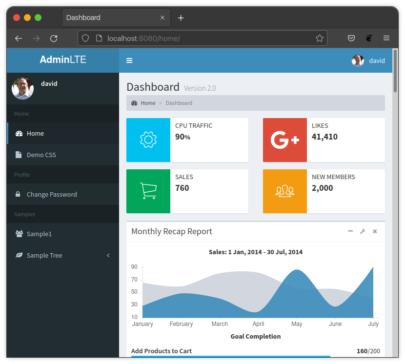

Examples
********

Static Menu Example
===================

**settings.py**

.. code:: python

    ADMINLTE2_MENU = [
        {
            'text': 'Home',
            'nodes': [
                {
                    'route': 'django_adminlte_2:home',
                    'text': 'Home',
                    'icon': 'fa fa-dashboard',
                },
                {
                    'route': 'django_adminlte_2:demo-css',
                    'text': 'Demo CSS',
                    'icon': 'fa fa-file'
                },
            ]
        },
        {
            'text': 'Profile',
            'nodes': [
                {
                    'route': 'password_change',
                    'text': 'Change Password',
                    'icon': 'fa fa-lock'
                }
            ]
        },
        {
            'text': 'Samples',
            'nodes': [
                {
                    'route': 'django_adminlte_2:sample1',
                    'text': 'Sample1',
                    'icon': 'fa fa-group',
                },
                {
                    'text': 'Sample Tree',
                    'icon': 'fa fa-leaf',
                    'nodes': [
                        {
                            'route': 'django_adminlte_2:sample2',
                            'text': 'Sample2',
                            'icon': 'fa fa-building',
                        },
                    ],
                },
            ],
        },
    ]

----

Dynamic and Static Menu Example
===============================

**settings.py**

.. code:: python
    :name: settings.py

    ADMINLTE2_MENU = [
        {
            'text': 'Home',
            'nodes': [
                {
                    'route': 'django_adminlte_2:home',
                    'text': 'Home',
                    'icon': 'fa fa-dashboard',
                },
                {
                    'route': 'django_adminlte_2:demo-css',
                    'text': 'Demo CSS',
                    'icon': 'fa fa-file'
                },
            ]
        },
    ]

**urls.py**

.. code:: python
    :name: urls.py

    urlpatterns = [

        path('dynamic/', views.dynamic, name="dynamic"),
        ...
    ]

**views.py**

.. code:: python
    :name: views.py

    def dynamic(request):
        """Show default dynamic page"""

        dynamic_content = [
            {
                'text': 'Dynamic Stuff',
                'nodes': [
                    {
                        'route': 'dynamic',
                        'text': 'Dynamic',
                        'icon': 'fa fa-circle',
                    },
                ]
            },
        ]

        return render(
            request,
            'dynamic.html',
            {
                'ADMINLTE2_MENU_FIRST': dynamic_content
            }
        )

**dynamic.html**

.. code:: html+django
    :name: dynamic.html

    
    
    
    <ol class="breadcrumb">
        
        <li>
            
        </li>
    </ol>
    
    
    <h1>This is the Dynamic page!</h1>
    

.. image:: ../../img/menu/django-adminlte-2-dynamic-menu.png
    :alt: Site with static and dynamic menu using settings and context
