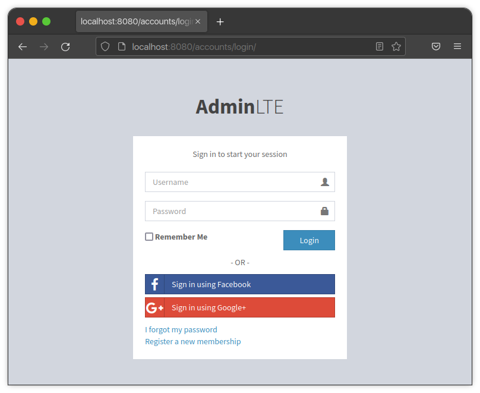

Templates
*********

General
=======

The main purpose of the **Django-AdminLTE-2** package is to streamline creation
of `Django <https://www.djangoproject.com/>`_ sites, using the
`AdminLTE2 <https://adminlte.io/themes/AdminLTE/index2.html>`_ theme.

As such, this package comes with many templates that are used right out of the
box, and an automagically-customized site look and feel, just by following the
minimal steps as described in :doc:`../quickstart`.

Any and all of these templates can be overridden to further customize the look
and feel of the site, depending on project needs. Rather than listing out every
single file and every single block within those files that can be overridden,
it is preferable that you just reference the files yourself. The files can be
found on
`GitHub <https://github.com/DJBarnes/django-adminlte-2/tree/master/django_adminlte_2/templates>`_.

.. important::

    In ``settings.py``, if you are using
    `APP_DIRS <https://docs.djangoproject.com/en/dev/howto/overriding-templates/#overriding-from-an-app-s-template-directory>`_
    to override templates, you must ensure that the app you are using to house
    those templates is listed in the
    `INSTALLED_APPS <https://docs.djangoproject.com/en/dev/ref/settings/#std-setting-INSTALLED_APPS>`_
    setting before the django-adminlte-2 app. Additionally, the
    django-adminlte-2 app should be listed before any django apps.

Example Customization
=====================

To show just how easy it can be to use and customize templates in the
**Django-AdminLTE-2** package, we can show an example. The following three steps
document customizing the login page **social links** section.

First, we can see what this page looks like by default:

To change this page, we can create a template to override the original behavior:

1.  Create ``registration/login.html`` in one of your django project's
    `template <https://docs.djangoproject.com/en/dev/ref/settings/#templates>`_
    folders, defined via the project settings file.
2.  Extend the packages default ``registration/login.html`` by adding the
    following line:

    .. code:: html+django

        

3.  Override the ``social_auth_links`` block. An empty block will remove the
    original content. Alternatively, a block with content will replace the
    original content.

    **Example of "Social Link" Section Removal**

    .. code:: html+django

        

    .. image:: ../../img/template/django-adminlte-2-login-template-no-social.png
        :alt: Updated login page with no social links

    **Example of "Social Link" Section Replacement**

    .. code:: html+django

        
          

            
- OR -

            <a href="#" class="btn btn-block btn-social btn-github btn-flat">
              <i class="fa fa-github"></i>
              Sign in using Github
            </a>
          

        

    .. image:: ../../img/template/django-adminlte-2-login-template-github.png
        :alt: Updated login page with GitHub as the social link.

Reminder to reference the
`GitHub files <https://github.com/DJBarnes/django-adminlte-2/tree/master/django_adminlte_2/templates>`_
to see all possible package templates that can be overridden.
